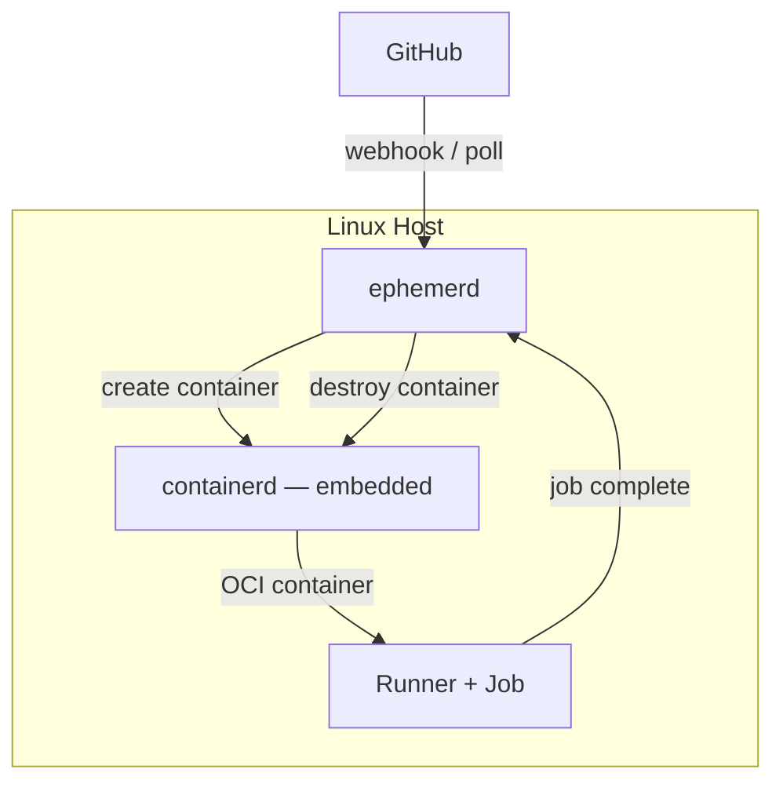
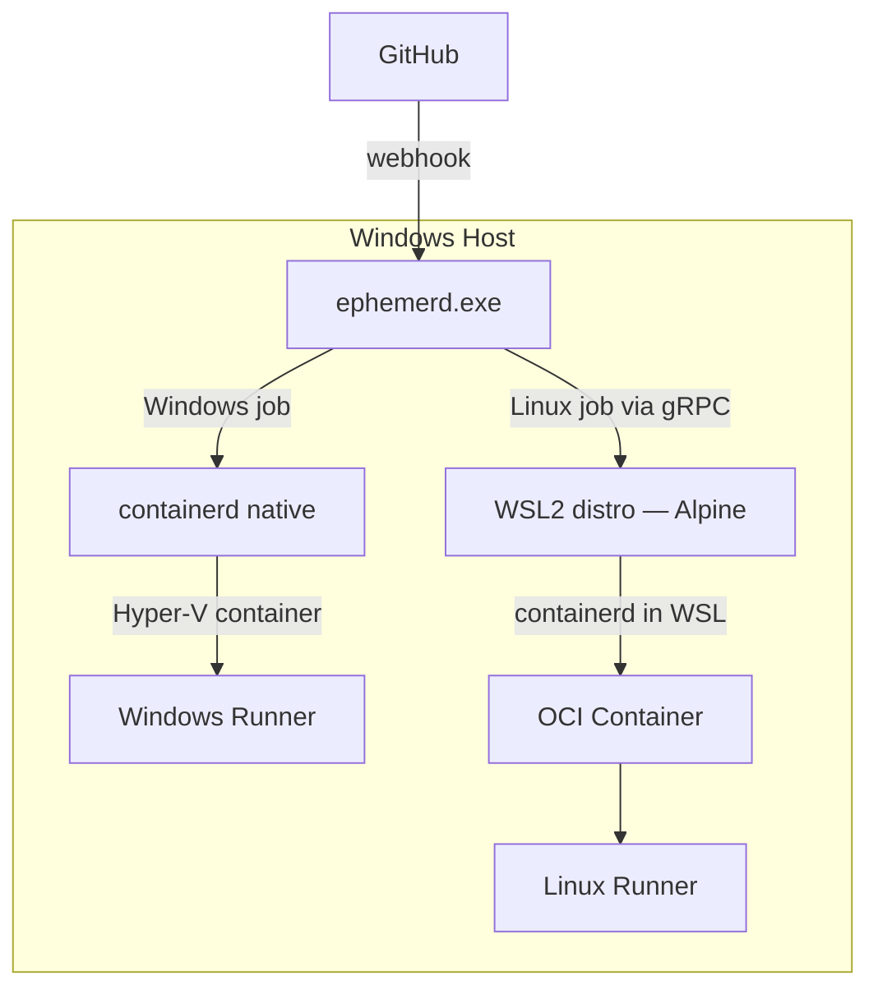
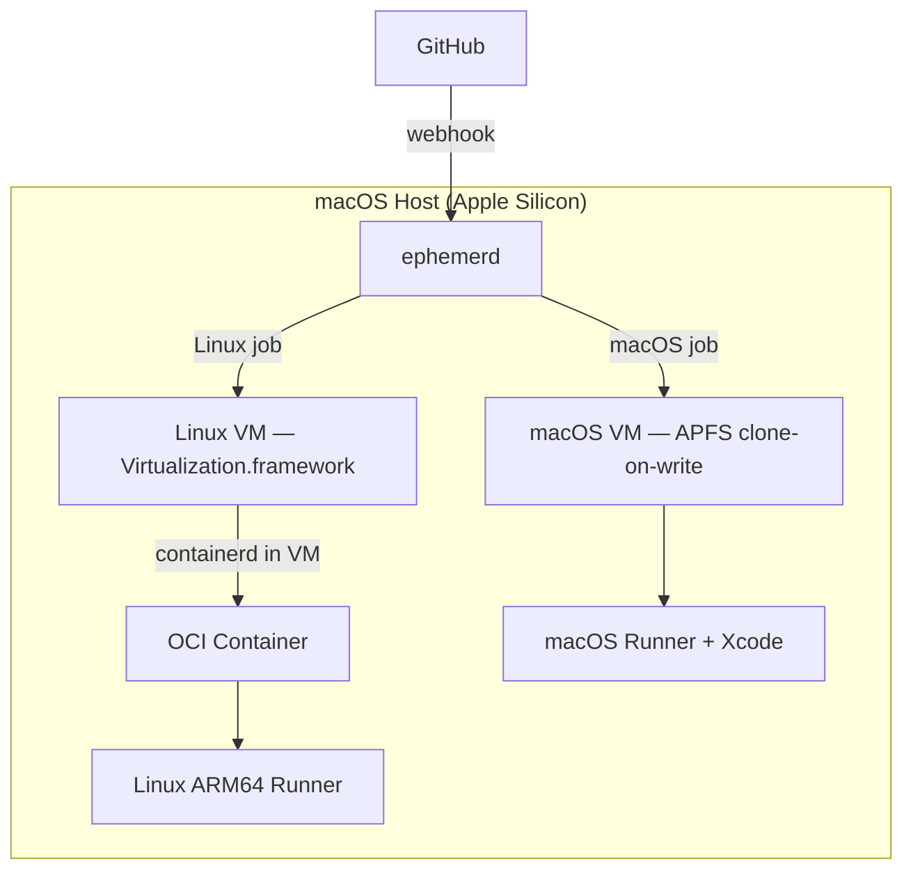
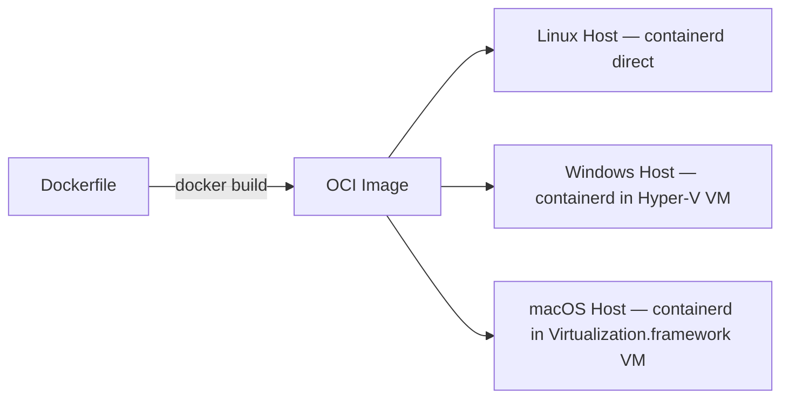
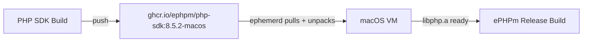
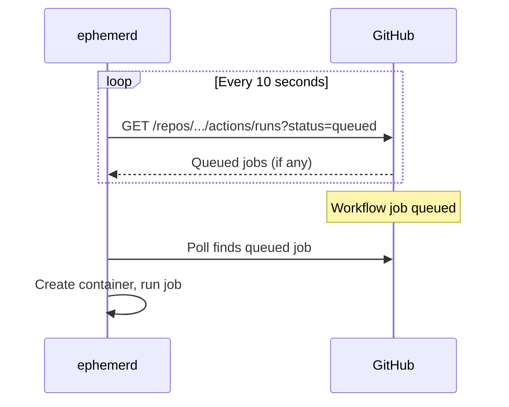
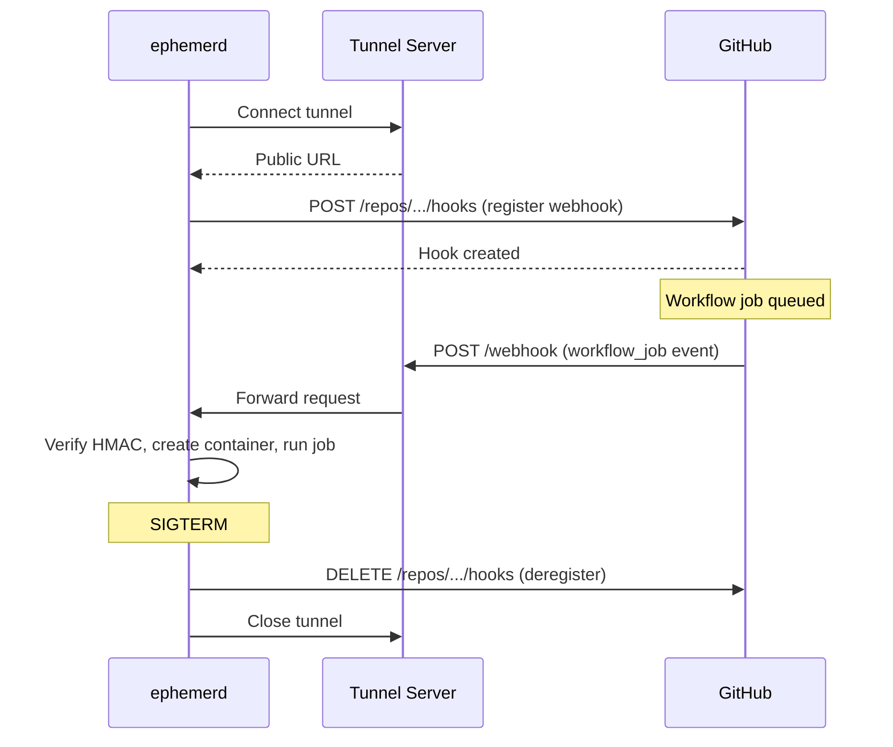

# ephemerd

Ephemeral GitHub Actions runner daemon. One binary, every platform. Secure by default.

ephemerd manages self-hosted GitHub Actions runners that are isolated, disposable, and automatic. Every job gets a fresh environment. When it's done, everything is destroyed. No leftover state, no security risk from untrusted PRs.

## Why

Self-hosted GitHub Actions runners on bare metal are a security problem — any PR can run arbitrary code on your machine. The existing solutions don't cover cross-platform:

- **ARC** requires Kubernetes. Linux only. No Windows.
- **Firecracker runners** are Linux only.
- **GitHub hosted runners** are expensive, limited ARM64, and you don't control the environment.

ephemerd is a single binary that runs on Linux, Windows, and macOS. It embeds containerd as a Go library (the same approach k3s and rke2 use) and manages the full lifecycle: receive job → create isolated environment → run → destroy.

## How It Works

### Linux

Containers run directly on the host via the embedded containerd. No VM needed — fastest path.



### Windows

Windows jobs run in Hyper-V isolated containers (each gets its own kernel). Linux jobs are dispatched to a WSL2 distro via gRPC — ephemerd embeds an Alpine rootfs and a cross-compiled Linux binary, imports a WSL distro on startup, and runs containerd inside it. The Windows host runs a single scheduler that routes jobs by OS label.

The WSL binary runs from `/mnt/c/` (the Windows filesystem mounted inside WSL) to avoid the slow 9P copy into the Linux filesystem. GitHub credentials stay on the Windows host — WSL only receives container lifecycle commands via gRPC dispatch.



### macOS

A long-running lightweight Linux VM (via Apple's Virtualization.framework) hosts containerd for Linux jobs — same OCI images, same Dockerfiles. macOS-native jobs (Xcode, Swift) get their own ephemeral macOS VM cloned from a base image via APFS copy-on-write (instant, no data copied until writes occur).

The Linux VM uses virtio-fs to share files between the host and VM. OCI artifact layers are extracted on the host and mounted into the VM, so macOS jobs can access pre-built artifacts without downloading them during the job.



### One Image, Every Host

OCI container images work everywhere. The same Dockerfile builds an image that runs on Linux directly, inside a Hyper-V Linux VM on Windows, and inside a Virtualization.framework Linux VM on macOS.



### OCI Images as Artifact Cache

OCI images aren't just for containers. ephemerd also uses them as a delivery mechanism for pre-built artifacts on macOS VM jobs. You package your build outputs into a scratch OCI image, push it to a registry, and ephemerd unpacks the layers into the VM before your job runs. This lets you chain build pipelines — build once, use everywhere.

**Example: packaging a darwin libphp.a**

Your PHP SDK pipeline builds `libphp.a` for darwin/arm64. Package it into an OCI image:

```dockerfile
FROM alpine AS fetch
ARG PHP_VERSION=8.5.2
RUN wget -O /tmp/sdk.tar.gz \
    https://github.com/ephpm/php-sdk/releases/download/v${PHP_VERSION}/php-sdk-${PHP_VERSION}-macos-aarch64.tar.gz && \
    mkdir -p /sdk && tar xzf /tmp/sdk.tar.gz -C /sdk

FROM scratch
COPY --from=fetch /sdk/ /php-sdk/
```

```bash
# Build for a specific PHP version
docker buildx build --platform linux/arm64 \
    --build-arg PHP_VERSION=8.5.2 \
    -t ghcr.io/ephpm/php-sdk:8.5.2-macos \
    -f Dockerfile.sdk --push .

# New PHP version? Just change the arg
docker buildx build --platform linux/arm64 \
    --build-arg PHP_VERSION=8.4.7 \
    -t ghcr.io/ephpm/php-sdk:8.4.7-macos \
    -f Dockerfile.sdk --push .
```

The final image is tiny — just the SDK files on a scratch base, no OS, no runtime. One Dockerfile handles every PHP version.

**Example: using it in a macOS job**

Your ePHPm release pipeline needs that `libphp.a` to build the final binary on macOS. Set `EPHEMERD_IMAGE` and ephemerd pulls the OCI image, unpacks it into the VM, and your job finds the files ready to go:

```yaml
jobs:
  build-macos:
    runs-on: [self-hosted, macos, arm64]
    env:
      EPHEMERD_IMAGE: ghcr.io/ephpm/php-sdk:8.5.2-macos
    steps:
      - uses: actions/checkout@v4
      - name: Build ephpm
        run: |
          export PHP_SDK_PATH=/ephemerd-artifacts/php-sdk
          cargo build --release
```

ephemerd handles the rest:

1. Boots an ephemeral macOS VM (clone-on-write from base snapshot)
2. Pulls `ghcr.io/ephpm/php-sdk:8.5.2-macos` via containerd
3. Unpacks the OCI layers into `/ephemerd-artifacts/` inside the VM
4. Starts the GitHub runner — the job finds `libphp.a` waiting at `/ephemerd-artifacts/php-sdk/`
5. Job completes, VM is destroyed



No downloading during the job. No recompiling PHP. The artifact is cached in the registry and unpacked in seconds. This same pattern works for any pre-built dependency — Rust toolchains, native libraries, test fixtures.

### Dual-Purpose Hosts

A single machine can serve multiple job types:

| Host | Linux jobs | Native OS jobs |
|------|-----------|----------------|
| Linux x86_64 | containerd direct | — |
| Linux arm64 | containerd direct | — |
| Windows x86_64 | Hyper-V Linux VM | Hyper-V Windows containers |
| macOS arm64 | Virtualization.framework Linux VM | macOS VM (clone-on-write) |

**A Windows box and a Mac Mini covers every combination:** linux/amd64, linux/arm64, windows/amd64.

## Quick Start

### 1. Install

Download the latest binary from [Releases](https://github.com/ephpm/ephemerd/releases), then:

```bash
sudo ./ephemerd install
```

This copies the binary to `/usr/local/bin/`, creates a default config at `/var/lib/ephemerd/config.toml`, and installs a systemd service (Linux), launchd plist (macOS), or Windows service.

Or build from source with `mage build`.

### 2. Configure

```bash
sudo vim /var/lib/ephemerd/config.toml   # set github.owner
sudo vim /etc/default/ephemerd           # set GITHUB_TOKEN
```

### 3. Start

```bash
sudo systemctl start ephemerd
sudo systemctl enable ephemerd   # start on boot
```

Or run manually:

```bash
export GITHUB_TOKEN="ghp_your_token_here"
sudo -E ephemerd serve
```

### Uninstall

```bash
sudo ephemerd uninstall
```

This stops the service, removes the binary, service files, and data directory. Use `--keep-data` to preserve your config and logs.

### 4. Target it from your workflow

```yaml
runs-on: [self-hosted, linux, x64]
```

## Choosing the Image

### Linux and Windows jobs (OCI containers)

Use the standard `container:` key in your workflow. ephemerd's containerd pulls the image and runs the job inside it:

```yaml
jobs:
  build-php:
    runs-on: [self-hosted, linux, x64]
    container:
      image: ghcr.io/myorg/php-builder:latest
    steps:
      - uses: actions/checkout@v4
      - run: make build

  build-windows:
    runs-on: [self-hosted, windows, x64]
    container:
      image: ghcr.io/myorg/windows-build:latest
    steps:
      - uses: actions/checkout@v4
      - run: nmake
```

### macOS jobs (VMs)

macOS jobs run in ephemeral VMs, not containers. The `container:` key doesn't work on macOS runners. Instead, set `EPHEMERD_IMAGE` in the job's env to select which VM snapshot to boot:

```yaml
jobs:
  build-ios:
    runs-on: [self-hosted, macos, arm64]
    env:
      EPHEMERD_IMAGE: xcode15
    steps:
      - uses: actions/checkout@v4
      - run: xcodebuild -scheme MyApp
```

ephemerd reads the workflow YAML from the GitHub API when a job is queued and picks up `EPHEMERD_IMAGE` before creating the VM. The value maps to a snapshot configured in ephemerd's `[vm.macos]` section.

If `EPHEMERD_IMAGE` is not set, the base macOS VM boots as-is — all the tools provisioned into the snapshot are already there.

## Configuration

```toml
[github]
# Authentication: PAT or GITHUB_TOKEN env var
# token = "ghp_..."                  # or set GITHUB_TOKEN env var
owner = "your-org"                    # org or user
# repos = ["repo1", "repo2"]         # optional — omit for org-level runners

[webhook]
# Default: localtunnel webhook delivery (instant, zero config)
# tunnel = "ngrok"                   # use ngrok instead (requires auth token)
# ngrok_authtoken = "..."            # or set NGROK_AUTHTOKEN env var
# tunnel = "none"                    # disable tunnel, fall back to polling

[runner]
max_concurrent = 4                    # parallel jobs
extra_labels = []                     # additional runner labels
job_timeout = "2h"                    # kill jobs after this
shutdown_timeout = "5m"               # wait for running jobs on SIGTERM

# Cross-OS Linux VM (Windows and macOS hosts only)
[vm.linux]
enabled = true                        # boot a Linux VM for Linux jobs
cpus = 2
memory_mb = 2048
disk_size_gb = 50                     # sparse — only uses space as needed

# macOS-native jobs (macOS hosts only)
[vm.macos]
enabled = false                       # enable macOS VM per-job
base_image = "/path/to/macos.img"    # provisioned base image
cpus = 4
memory_mb = 8192

[log]
level = "info"                        # debug, info, warn, error
format = "text"                       # text or json
```

## Job Discovery

### Polling (default)

By default, ephemerd polls the GitHub API for queued jobs. No inbound ports, no tunnels, no TLS certificates — works behind NAT, on laptops, anywhere.



Jobs start within 10 seconds of being queued. Tune the interval in the config:

```toml
[github]
poll_interval = "5s"   # faster polling, uses more API quota
```

#### Rate limits and GitHub App authentication

A personal access token (PAT) gets 5,000 API requests per hour. At the default 10s poll interval, ephemerd uses ~360 requests/hour per repo — fine for a few repos, but it adds up.

For higher limits, use a [GitHub App](https://docs.github.com/en/apps/creating-github-apps/about-creating-github-apps/about-creating-github-apps) instead of a PAT. GitHub Apps get 15,000 requests per hour per installation and don't count against your personal quota.

1. [Create a GitHub App](https://github.com/settings/apps/new) with these permissions:
   - **Repository permissions**: Actions (read), Administration (read/write)
   - **Organization permissions**: Self-hosted runners (read/write)
   - **Subscribe to events**: Workflow job
2. Generate a private key and download the `.pem` file
3. Install the app on your org or repos
4. Configure ephemerd:

```toml
[github]
app_id = 123456
installation_id = 789012
private_key_path = "/path/to/app.pem"
owner = "your-org"
```

ephemerd automatically refreshes the installation token before it expires.

### Webhook via Tunnel (opt-in)

For instant job delivery with zero latency, ephemerd can create a tunnel and register webhooks automatically. On startup it generates a random HMAC secret, registers a `workflow_job` webhook on GitHub, and starts receiving events. On shutdown, the webhook is removed.



We recommend a self-hosted localtunnel server ($5/month Linode Nanode — see [examples/localtunnel](examples/localtunnel)) over the free public server, which is unreliable.

```toml
[webhook]
tunnel = "localtunnel"
tunnel_url = "http://tunnels.example.com"
```

Or use [ngrok](https://ngrok.com) (requires free account):

```toml
[webhook]
tunnel = "ngrok"
ngrok_authtoken = "your-token"
```

## Security

Every job runs in full isolation:

- **Ephemeral environments** — created per job, destroyed after. No state leaks between jobs.
- **Hyper-V isolation on Windows** — each container gets its own kernel. Real VM-level isolation.
- **Network firewall** — containers are blocked from RFC 1918 and link-local ranges by default. Jobs can reach the internet but not your LAN.
- **Read-only runner mount** — the GitHub Actions runner binary is bind-mounted read-only.
- **No host access** — no Docker socket, no host filesystem, no privileged mode.

## CLI

```
ephemerd serve          Start the daemon
ephemerd status         Show running jobs, health, uptime
ephemerd drain          Stop accepting new jobs, wait for running jobs
ephemerd images         List cached container images
ephemerd config         Validate configuration
ephemerd doctor         Check system readiness and clean up stale state
ephemerd install        Install binary and register as a system service
ephemerd uninstall      Remove binary, service, and data
ephemerd ctrctl         Debug the embedded containerd (passthrough to ctr)
```

`ctrctl` gives you direct access to the embedded containerd — list containers, inspect images, check snapshots. Same as `rke2 ctr` from the rke2 world.

## Building Runner Images

ephemerd uses standard OCI images. Build them with Docker:

```dockerfile
FROM ubuntu:24.04

RUN apt-get update && apt-get install -y \
    build-essential cmake autoconf automake \
    git curl wget pkg-config

# Add your project-specific tools
# RUN curl --proto '=https' --tlsv1.2 -sSf https://sh.rustup.rs | sh -s -- -y
# COPY libphp.a /usr/local/lib/
```

```bash
docker build -t ghcr.io/your-org/ephemerd-build:latest .
docker push ghcr.io/your-org/ephemerd-build:latest
```

The same image runs on every host — Linux directly, Windows via Hyper-V Linux VM, macOS via Virtualization.framework Linux VM.

## Known Limitations

**Windows `services:` / `container:` YAML keys** — GitHub's runner binary blocks these on Windows. Use `docker run` in job steps instead:

```yaml
- run: docker run -d --name mysql -p 3306:3306 mysql:8
- run: run-tests.sh
- run: docker stop mysql
```

**macOS builds require macOS** — the darwin binary uses Virtualization.framework (CGO + Apple SDK). Cross-compilation from Linux isn't possible. Build on a Mac or use GitHub's macOS hosted runners for the darwin release.

**No Docker-in-Docker** — containers run with a restricted capability set (no `CAP_SYS_ADMIN` or `CAP_NET_ADMIN`), so `docker build` and `docker compose` won't work inside jobs. For building container images in CI, use [Kaniko](https://github.com/GoogleContainerTools/kaniko) or [Buildah](https://github.com/containers/buildah) which run in userspace without a daemon.

**ARM64 Windows** — ephemerd supports it at the infrastructure level, but PHP and most build toolchains don't ship ARM64 Windows binaries yet.

## Architecture

See [docs/arch/overview.md](docs/arch/overview.md) for the full design document covering isolation backends, embedded containerd, VM lifecycle, and the GitHub integration model.

## License

MIT
