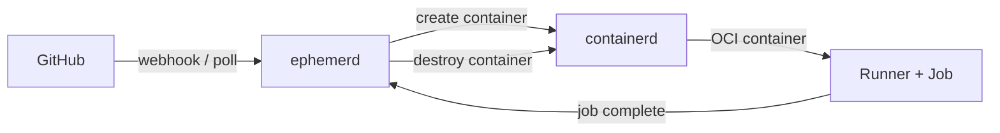
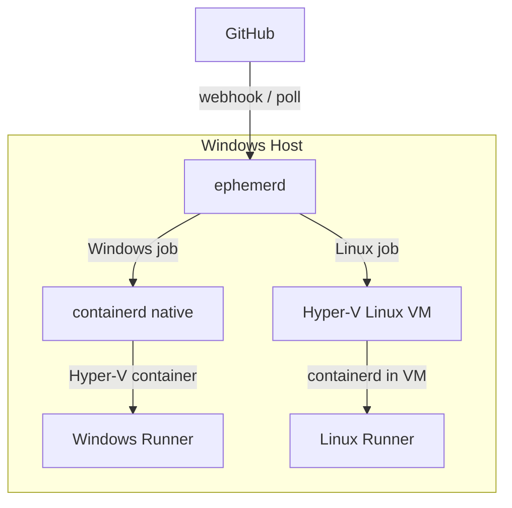
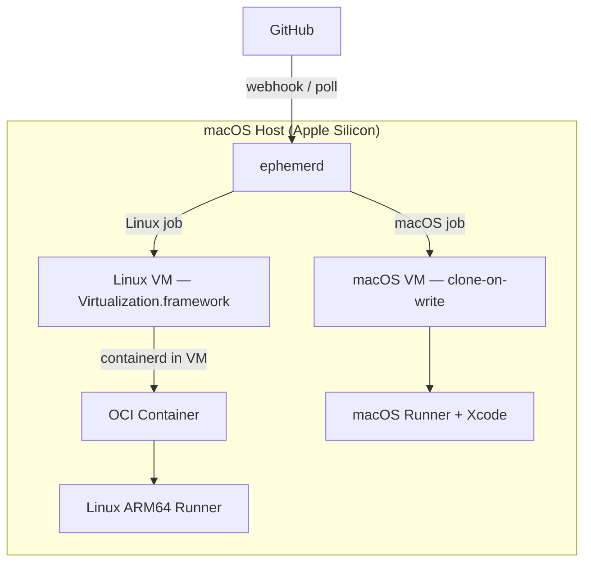
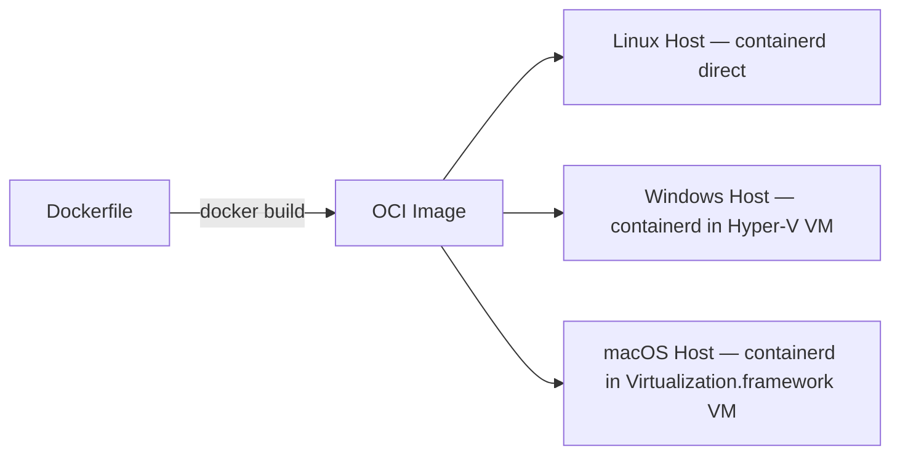

# ephemerd

Ephemeral GitHub Actions runner daemon. One binary, every platform. Secure by default.

ephemerd manages self-hosted GitHub Actions runners that are isolated, disposable, and automatic. Every job gets a fresh environment. When it's done, everything is destroyed. No leftover state, no security risk from untrusted PRs.

## Why

Self-hosted GitHub Actions runners on bare metal are a security problem — any PR can run arbitrary code on your machine. The existing solutions don't cover cross-platform:

- **ARC** requires Kubernetes. Linux only. No Windows.
- **Firecracker runners** are Linux only.
- **GitHub hosted runners** are expensive, limited ARM64, and you don't control the environment.

ephemerd is a single binary that runs on Linux, Windows, and macOS. It embeds containerd as a Go library (the same approach k3s and rke2 use) and manages the full lifecycle: receive job → create isolated environment → run → destroy.

## How It Works

### Linux

Containers run directly on the host via the embedded containerd. No VM needed — fastest path.



### Windows

Windows jobs run in Hyper-V isolated containers (each gets its own kernel). Linux jobs run inside a Hyper-V Linux VM with containerd inside it — same OCI images as native Linux.



### macOS

A long-running lightweight Linux VM hosts containerd for Linux jobs — same OCI images, same Dockerfiles. macOS-native jobs (Xcode, Swift) get their own ephemeral macOS VM cloned from a base image via APFS copy-on-write (instant, no data copied until writes occur).



### One Image, Every Host

OCI container images work everywhere. The same Dockerfile builds an image that runs on Linux directly, inside a Hyper-V Linux VM on Windows, and inside a Virtualization.framework Linux VM on macOS.



### Dual-Purpose Hosts

A single machine can serve multiple job types:

| Host | Linux jobs | Native OS jobs |
|------|-----------|----------------|
| Linux x86_64 | containerd direct | — |
| Linux arm64 | containerd direct | — |
| Windows x86_64 | Hyper-V Linux VM | Hyper-V Windows containers |
| macOS arm64 | Virtualization.framework Linux VM | macOS VM (clone-on-write) |

**A Windows box and a Mac Mini covers every combination:** linux/amd64, linux/arm64, windows/amd64.

## Quick Start

### 1. Install

Download the binary for your platform from [Releases](https://github.com/ephpm/ephemerd/releases), or build from source:

```bash
make build
```

### 2. Configure

```bash
mkdir -p /var/lib/ephemerd
cat > /var/lib/ephemerd/config.toml << 'EOF'
[github]
token = "ghp_your_token_here"
owner = "your-org"
repos = ["repo1", "repo2"]

[runner]
default_image = "ghcr.io/ephpm/ephemerd-build:latest"
max_concurrent = 4
EOF
```

### 3. Run

```bash
sudo ephemerd serve
```

ephemerd starts containerd, begins polling GitHub for queued jobs, and provisions a container for each one.

### 4. Target it from your workflow

```yaml
runs-on: [self-hosted, linux, x64]
```

## Configuration

```toml
[github]
token = "ghp_..."                     # PAT with repo + admin:org scope
owner = "your-org"                    # org or user
repos = ["repo1", "repo2"]           # repos to register runners for
poll_interval = "10s"                 # how often to check for jobs (default)

# Optional: webhook mode (instant, requires TLS)
# webhook_port = 8080
# webhook_secret = "your_secret"
# tls_cert = "/etc/ephemerd/tls.crt"
# tls_key = "/etc/ephemerd/tls.key"

[runner]
default_image = "ghcr.io/ephpm/ephemerd-build:latest"
max_concurrent = 4                    # parallel jobs
extra_labels = []                     # additional runner labels
job_timeout = "2h"                    # kill jobs after this
shutdown_timeout = "5m"               # wait for running jobs on SIGTERM

# Cross-OS Linux VM (Windows and macOS hosts only)
[vm.linux]
enabled = true                        # boot a Linux VM for Linux jobs
cpus = 2
memory_mb = 2048
disk_size_gb = 50                     # sparse — only uses space as needed

# macOS-native jobs (macOS hosts only)
[vm.macos]
enabled = false                       # enable macOS VM per-job
base_image = "/path/to/macos.img"    # provisioned base image
cpus = 4
memory_mb = 8192

[log]
level = "info"                        # debug, info, warn, error
format = "text"                       # text or json
```

## Job Discovery

**Polling (default):** ephemerd checks the GitHub API every 10 seconds for queued jobs. No inbound ports, no TLS certificates, works behind NAT. Ideal for homelab.

**Webhook:** Add `tls_cert` and `tls_key` to enable a TLS webhook server. Configure a GitHub webhook pointing to `https://your-host:8080/webhook` with the `workflow_job` event. Instant job delivery, no polling delay.

## Security

Every job runs in full isolation:

- **Ephemeral environments** — created per job, destroyed after. No state leaks between jobs.
- **Hyper-V isolation on Windows** — each container gets its own kernel. Real VM-level isolation.
- **Network firewall** — containers are blocked from RFC 1918 and link-local ranges by default. Jobs can reach the internet but not your LAN.
- **Read-only runner mount** — the GitHub Actions runner binary is bind-mounted read-only.
- **No host access** — no Docker socket, no host filesystem, no privileged mode.

## CLI

```
ephemerd serve          Start the daemon
ephemerd status         Show running jobs, health, uptime
ephemerd drain          Stop accepting new jobs, wait for running jobs
ephemerd images         List cached container images
ephemerd config         Validate configuration
ephemerd ctrctl         Debug the embedded containerd (passthrough to ctr)
```

`ctrctl` gives you direct access to the embedded containerd — list containers, inspect images, check snapshots. Same as `rke2 ctr` from the rke2 world.

## Building Runner Images

ephemerd uses standard OCI images. Build them with Docker:

```dockerfile
FROM ubuntu:24.04

RUN apt-get update && apt-get install -y \
    build-essential cmake autoconf automake \
    git curl wget pkg-config

# Add your project-specific tools
# RUN curl --proto '=https' --tlsv1.2 -sSf https://sh.rustup.rs | sh -s -- -y
# COPY libphp.a /usr/local/lib/
```

```bash
docker build -t ghcr.io/your-org/ephemerd-build:latest .
docker push ghcr.io/your-org/ephemerd-build:latest
```

The same image runs on every host — Linux directly, Windows via Hyper-V Linux VM, macOS via Virtualization.framework Linux VM.

## Known Limitations

**Windows `services:` / `container:` YAML keys** — GitHub's runner binary blocks these on Windows. Use `docker run` in job steps instead:

```yaml
- run: docker run -d --name mysql -p 3306:3306 mysql:8
- run: run-tests.sh
- run: docker stop mysql
```

**macOS builds require macOS** — the darwin binary uses Virtualization.framework (CGO + Apple SDK). Cross-compilation from Linux isn't possible. Build on a Mac or use GitHub's macOS hosted runners for the darwin release.

**ARM64 Windows** — ephemerd supports it at the infrastructure level, but PHP and most build toolchains don't ship ARM64 Windows binaries yet.

## Architecture

See [docs/architecture.md](docs/architecture.md) for the full design document covering isolation backends, embedded containerd, VM lifecycle, and the GitHub integration model.

## License

MIT
