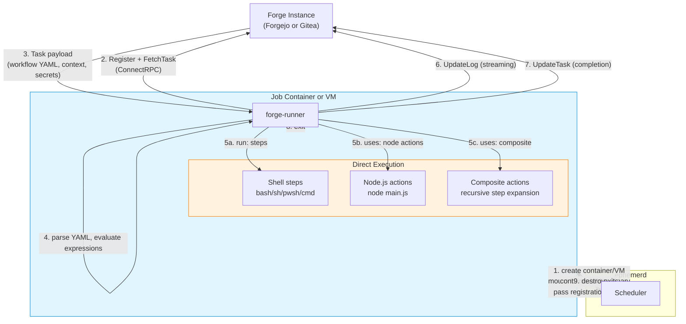
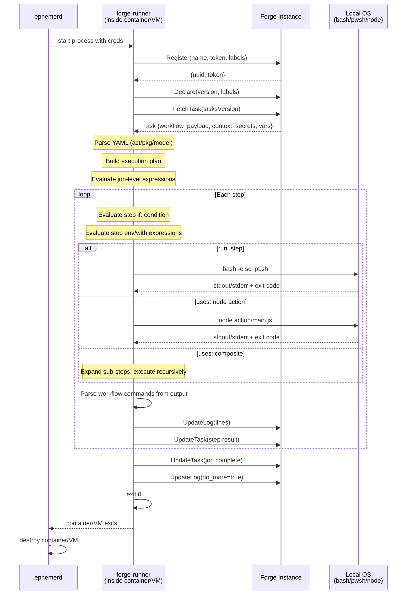

# forge-runner: A GHA-Style Runner for Forgejo & Gitea

> **Status: Design spec.** No code exists. This document proposes a new runner binary that replaces `forgejo-runner`/`act_runner` for ephemerd's use case.

## Problem

The current Forgejo/Gitea runners (`forgejo-runner`, `act_runner`) embed [nektos/act](https://github.com/nektos/act) as their execution engine. act uses the Docker API to create a **separate container** for every job:

```
[ runner container ] --docker API--> [ job container ]
```

This two-container model has fundamental problems for ephemerd:

1. **Linux-only.** act only knows how to create Linux Docker containers. No path to Windows or macOS jobs.
2. **Docker dependency.** Requires a Docker socket (real or fake) and container lifecycle translation.
3. **Extra complexity.** Two containers, sibling tagging, socket interception, container-create API endpoints that don't exist yet in `pkg/dind`.
4. **Inconsistent with GitHub.** The GHA runner is a single binary that runs inside the container and executes steps directly. No Docker-in-Docker.

## Proposal

Build **forge-runner** — a Go binary that speaks the Forgejo/Gitea ConnectRPC protocol but executes like the GitHub Actions runner: **direct process execution inside a single container or VM**.

```
Current (act-based):  [ runner daemon ] --docker--> [ job container (steps run here) ]
Proposed:             [ single container/VM with forge-runner + steps ]
```

This gives us:
- **Single-container model** matching GHA — one OCI image, one container, done
- **Multi-OS support** — same binary runs in Linux containers, Windows containers, macOS VMs
- **No Docker socket** — no fake socket, no container lifecycle translation
- **Consistent architecture** — every provider (GitHub, Forgejo, Gitea, GitLab) uses the same pattern

## Architecture



### How It Differs from GHA Runner

The GHA runner (C#/.NET) receives a **pre-processed job message** from GitHub — the server parses YAML, expands matrices, resolves dependencies, and sends a flat list of steps. The runner just executes them.

Forgejo/Gitea sends **raw workflow YAML** in the `FetchTask` response. The runner must parse it, plan execution, expand matrices, evaluate expressions, and resolve actions. This is work that GitHub's server does but forge servers don't.

Fortunately, nektos/act has clean, importable Go packages for exactly this:

| Responsibility | GHA (server does it) | Forge (runner must do it) | Source |
|----------------|---------------------|--------------------------|--------|
| YAML parsing | Server | `pkg/model.ReadWorkflow()` | act |
| Matrix expansion | Server | `pkg/model.WorkflowPlanner` | act |
| Job dependency graph | Server | `pkg/model.Plan` with stages | act |
| Expression evaluation | Runner (.NET libs) | `pkg/exprparser.Evaluate()` | act |
| Step execution | Runner (process spawn) | **New code** | forge-runner |
| Action resolution | Runner (download + run) | **New code** (git clone + dispatch) | forge-runner |
| Log streaming | Runner (REST batching) | **New code** (ConnectRPC `UpdateLog`) | forge-runner |

## Components

### Reusable from act (import as Go libraries)

These packages are Docker-free and can be imported directly from `github.com/nektos/act`:

**`pkg/model`** — Workflow and action YAML parser, job planner.
- `model.ReadWorkflow(reader, strict)` — parse workflow YAML
- `model.ReadAction(reader)` — parse action.yml
- `WorkflowPlanner.PlanEvent(event)` — topologically-sorted execution plan
- `Step.ShellCommand()` — generate correct shell invocation per platform
- Full support for matrix, needs, composite actions, reusable workflows

**`pkg/exprparser`** — Complete `${{ }}` expression evaluator.
- All built-in functions: `contains`, `startsWith`, `format`, `join`, `toJSON`, `fromJSON`, `hashFiles`, `success`, `failure`, `always`, `cancelled`
- All context objects: `github`, `env`, `job`, `steps`, `runner`, `secrets`, `vars`, `matrix`, `strategy`, `needs`, `inputs`
- Populate `EvaluationEnvironment` with your own data, call `Evaluate()`

**`pkg/common`** — Executor combinators (`Then`, `Finally`, `If`), cartesian product, logging.

**`pkg/common/git`** — Git clone, ref lookup, GitHub repo discovery.

**`pkg/schema`** — JSON Schema validation for workflow/action YAML.

**`pkg/workflowpattern`** — Branch/path glob matching for `on:` filters.

**`pkg/artifactcache`** — Local artifact cache server.

### New Code (forge-runner)

#### 1. ConnectRPC Protocol Client

~200 lines. Import the proto definitions and implement the 5 RPCs:

```go
// Proto: code.forgejo.org/forgejo/actions-proto (Forgejo)
//    or: code.gitea.io/actions-proto-go          (Gitea)

type Client struct {
    runnerService runnerv1connect.RunnerServiceClient
    token         string
    runnerUUID    string
}

func (c *Client) Register(ctx, name, token, labels, version) (*Runner, error)
func (c *Client) Declare(ctx, version, labels) error
func (c *Client) FetchTask(ctx, tasksVersion) (*Task, error)
func (c *Client) UpdateTask(ctx, taskID, state, stepResults) error
func (c *Client) UpdateLog(ctx, taskID, index, rows, noMore) (ackIndex, error)
```

Build-tag or module path switches between Forgejo and Gitea proto packages. The wire format is identical.

#### 2. Step Executor

The core execution engine. ~500 lines. Four step handlers:

**ScriptHandler** (`run:` steps)
```
1. Evaluate step environment variables and expressions
2. Write script body to temp file (.sh, .ps1, .cmd, .py)
3. Spawn shell process: bash -e script.sh / pwsh -f script.ps1
4. Capture stdout/stderr, parse workflow commands
5. Stream logs via UpdateLog
6. Return exit code
```

Default shell by platform:
- Linux: `bash` (fallback `sh`)
- Windows: `pwsh` (fallback `powershell`, then `cmd`)
- macOS: `bash`

This matches GHA runner's `ScriptHandler` behavior. act's `model.Step.ShellCommand()` already generates the correct invocation string per shell type.

**NodeHandler** (`uses:` with `runs.using: node20`)
```
1. Clone action repo (or use cached copy)
2. Read action.yml for main/pre/post entrypoints
3. Set INPUT_* environment variables from step.with
4. Execute: node <action-dir>/main.js
5. Parse stdout for workflow commands
```

Requires a Node.js binary in the container image. The GHA runner bundles `node20`/`node24` in its externals directory — we'd do the same, or require it in the base image.

**CompositeHandler** (`uses:` with `runs.using: composite`)
```
1. Clone action repo, read action.yml
2. Parse steps from runs.steps
3. Map inputs to environment variables
4. Recursively execute each sub-step (may contain more composites)
5. Map outputs from step results
```

Composite actions are the most complex handler because they're recursive and create scoped execution contexts. Max nesting depth should be capped (GHA uses ~10).

**DockerHandler** (`uses: docker://image` or `runs.using: docker`)
```
Linux only. Optional for MVP.
1. Pull image
2. Run container with workspace mounted
3. Capture output
```

This is the one handler that needs Docker/containerd access. It's only relevant for actions that explicitly use `docker://` images. Many workflows never hit this path. Can be deferred or implemented via ephemerd's containerd client.

#### 3. Action Resolver

~300 lines. Downloads and caches action repositories.

```go
type ActionCache interface {
    // Resolve downloads an action and returns the local path.
    Resolve(ctx context.Context, ref ActionRef) (string, error)
}

type ActionRef struct {
    Owner string  // "actions"
    Repo  string  // "checkout"
    Ref   string  // "v4"
    Path  string  // "" or "sub/action"
}
```

Implementation:
1. Check local cache: `<cache-dir>/actions/<owner>/<repo>@<ref>/`
2. If miss: `git clone --depth=1 --branch=<ref>` or download tarball via API
3. Read `action.yml` / `action.yaml` from the action directory
4. Return local path

act's `GoGitActionCache` can be referenced but is entangled with `RunContext`. A clean reimplementation is simpler.

#### 4. Workflow Command Handler

~100 lines. Parses `::command::` directives from process stdout:

```
::set-output name=foo::bar          -> step output "foo" = "bar"
::set-env name=MY_VAR::value        -> add to env for subsequent steps
::add-path::/usr/local/bin          -> prepend to PATH
::add-mask::secret-value            -> register for log masking
::error file=f,line=1::message      -> annotation
::warning::message                  -> annotation
::group::name                       -> log grouping
::endgroup::                        -> end log group
::debug::message                    -> debug log
::stop-commands::token              -> disable command processing
```

Also handles file-based commands (GHA's newer mechanism):
- `GITHUB_OUTPUT` — step outputs via file append
- `GITHUB_ENV` — environment variables via file append
- `GITHUB_PATH` — PATH prepend via file append
- `GITHUB_STEP_SUMMARY` — markdown summary via file append

#### 5. Log Reporter

~150 lines. Batches log lines and streams to the forge via `UpdateLog`:

```go
type LogReporter struct {
    client    *Client
    taskID    int64
    buffer    []*LogRow
    ackIndex  int64
    ticker    *time.Ticker  // flush every 250ms
    masker    *SecretMasker
}

func (r *LogReporter) Write(p []byte) (int, error)  // io.Writer for process stdout/stderr
func (r *LogReporter) Flush(ctx context.Context) error
func (r *LogReporter) Close(ctx context.Context) error  // sends no_more=true
```

The masker scrubs all registered secrets from log output before buffering. Secrets are registered from the task payload and from `::add-mask::` commands.

#### 6. Context Builder

~200 lines. Builds the `github`, `runner`, `job`, `steps`, etc. context objects from the forge's task payload:

```go
func BuildGitHubContext(task *Task) *model.GithubContext {
    // task.Context is a structpb.Struct with github, gitea/forgejo context
    // Map to model.GithubContext for expression evaluation
}

func BuildRunnerContext() map[string]interface{} {
    return map[string]interface{}{
        "os":         runtime.GOOS,
        "arch":       runtime.GOARCH,
        "name":       hostname,
        "tool_cache": "/opt/hostedtoolcache",
        "temp":       os.TempDir(),
        "workspace":  workspaceDir,
    }
}
```

## Execution Flow



## Container/VM Images

With the single-container model, the job image IS the runner image. Each platform needs a base image with forge-runner + common CI tools pre-installed:

| Platform | Image | Contents |
|----------|-------|----------|
| Linux | `ghcr.io/ephpm/forge-runner:ubuntu-24.04` | Ubuntu 24.04 + forge-runner + git + node20 + common tools |
| Windows | `ghcr.io/ephpm/forge-runner:windows-ltsc2025` | Server Core + forge-runner.exe + git + node20 + pwsh |
| macOS | Base VM snapshot | macOS + forge-runner + Xcode CLI + Homebrew + node20 |

The images are analogous to GitHub's `ghcr.io/actions/actions-runner` — a full environment, not just a runner binary. ephemerd mounts forge-runner into the container using the same extract+bind-mount pattern it uses for the GHA runner today (`pkg/runner` embed).

### Label Mapping

The forge-runner registers with labels that map `runs-on:` values to image selection on the ephemerd side. The runner itself doesn't choose images — ephemerd does, based on the label:

```toml
[forgejo]
instance_url = "https://codeberg.org"
token = "..."

[forgejo.labels]
"ubuntu-latest" = "ghcr.io/ephpm/forge-runner:ubuntu-24.04"
"ubuntu-24.04"  = "ghcr.io/ephpm/forge-runner:ubuntu-24.04"
"windows-latest" = "ghcr.io/ephpm/forge-runner:windows-ltsc2025"
"macos-latest"  = "macos"  # triggers macOS VM path
```

## Platform Support

### Linux (Phase 1)

Identical to the current GHA model:
1. ephemerd pulls `ghcr.io/ephpm/forge-runner:ubuntu-24.04`
2. Creates containerd container, bind-mounts forge-runner binary
3. forge-runner registers, fetches task, executes steps directly
4. Container destroyed on completion

Works on all host OSes (Linux direct, Windows via WSL2, macOS via Vz VM).

### Windows (Phase 2)

Same as GHA Windows jobs today:
1. ephemerd creates a Hyper-V isolated Windows container from `forge-runner:windows-ltsc2025`
2. Bind-mounts `forge-runner.exe` (cross-compiled for Windows)
3. forge-runner registers with `windows-latest` label
4. Steps execute via `pwsh` / `powershell` / `cmd` directly
5. Container destroyed on completion

Requirements:
- Cross-compile forge-runner for `GOOS=windows`
- Windows container image with Git, Node.js, PowerShell pre-installed
- Windows host with Hyper-V (same as current GHA Windows support)

### macOS (Phase 3)

Same as GHA macOS jobs today:
1. ephemerd clones base macOS VM snapshot (APFS copy-on-write)
2. forge-runner pre-installed in the snapshot (macOS arm64 binary)
3. forge-runner registers with `macos-latest` label
4. Steps execute via `bash` / `zsh` directly
5. VM destroyed on completion

Requirements:
- Cross-compile forge-runner for `GOOS=darwin GOARCH=arm64`
- Base VM snapshot with Xcode CLI tools, Homebrew, Node.js
- Apple Silicon host with Virtualization.framework

## What We Don't Need to Build

| Concern | Why we skip it |
|---------|---------------|
| Workflow triggering | Forge server handles event matching |
| Job queueing/scheduling | Forge server queues tasks, ephemerd manages concurrency |
| Runner auto-update | ephemerd controls the binary version |
| OS service management | ephemerd manages the process lifecycle |
| Multiple concurrent jobs | One forge-runner per container/VM, ephemerd parallelizes |
| Container-based `services:` | Defer to Phase 2 — most workflows don't use service containers |
| `docker://` action support | Defer — most actions are JavaScript or composite |
| Reusable workflow calls | Defer — lower priority, can be added incrementally |
| OIDC token endpoint | Defer — requires forge server support |

## Estimated Scope

| Component | Lines (est.) | Depends on | Priority |
|-----------|-------------|------------|----------|
| ConnectRPC client | ~200 | actions-proto | Phase 1 |
| Job orchestrator (plan → execute) | ~400 | act/pkg/model | Phase 1 |
| ScriptHandler (run: steps) | ~150 | — | Phase 1 |
| NodeHandler (JS actions) | ~200 | Node.js in image | Phase 1 |
| CompositeHandler | ~250 | — | Phase 1 |
| Action resolver + cache | ~300 | git | Phase 1 |
| Workflow command parser | ~100 | — | Phase 1 |
| Log reporter + secret masker | ~200 | — | Phase 1 |
| Context builder | ~200 | act/pkg/exprparser | Phase 1 |
| File commands (GITHUB_ENV, etc.) | ~100 | — | Phase 1 |
| **Phase 1 total** | **~2,100** | | |
| Service containers | ~300 | containerd client | Phase 2 |
| DockerHandler (docker:// actions) | ~200 | containerd client | Phase 2 |
| Windows shell support | ~100 | cross-compile | Phase 2 |
| Reusable workflow calls | ~300 | — | Phase 3 |

~2,100 lines of new Go code for Phase 1 (Linux jobs, script + node + composite actions). This is comparable in scope to the existing `pkg/github` + `pkg/scheduler` code.

## Project Structure

```
cmd/forge-runner/
    main.go              # CLI entrypoint, registration, task loop

pkg/forgerunner/
    client.go            # ConnectRPC protocol client
    executor.go          # Job orchestrator (plan → steps → execute)
    step_script.go       # run: step handler
    step_node.go         # uses: node action handler
    step_composite.go    # uses: composite action handler
    step_docker.go       # uses: docker:// handler (Phase 2)
    actions.go           # Action resolver + cache
    commands.go          # Workflow command parser (::set-output::, etc.)
    filecommands.go      # GITHUB_ENV, GITHUB_OUTPUT, GITHUB_PATH files
    context.go           # Build github/runner/job/steps contexts
    log.go               # Log batching + secret masking + UpdateLog
    masker.go            # Secret masker (register + scrub)
```

forge-runner is built as a separate binary (`cmd/forge-runner/`) and embedded in ephemerd the same way the GHA runner is today (`pkg/runner` embed). It's a single static Go binary — no runtime dependencies beyond what's in the container image.

## Comparison

| Aspect | forgejo-runner (act) | forge-runner (proposed) | GHA runner |
|--------|---------------------|------------------------|------------|
| Language | Go | Go | C# (.NET) |
| Execution | Docker containers | Direct process | Direct process |
| Container model | Two (runner + job) | One | One |
| YAML parsing | act library | act library | Server-side |
| Expression eval | act library | act library | .NET SDK |
| Docker dependency | Required | None | Optional (for docker:// actions) |
| Multi-OS | Linux only | Linux, Windows, macOS | Linux, Windows, macOS |
| Forge protocol | ConnectRPC | ConnectRPC | GitHub REST |
| Binary size | ~50MB (includes act) | ~15MB (est.) | ~200MB (.NET runtime) |

## Open Questions

1. **Upstream or ephemerd-only?** forge-runner could be useful to the broader Forgejo/Gitea community as a lightweight alternative to act-based runners. Consider publishing as a separate project.

2. **Proto package selection.** Forgejo and Gitea protos have diverged. Use build tags (`//go:build forgejo` / `//go:build gitea`) or compile two binaries? Or use the Forgejo proto (superset) and accept Gitea compatibility?

3. **Node.js bundling.** Bundle node20 in the runner binary (like GHA) or require it in the container image? Bundling adds ~40MB but removes a dependency.

4. **Action compatibility.** What percentage of GitHub Actions marketplace actions work without modification? JavaScript and composite actions should work. Docker actions need the optional DockerHandler. Actions that use GitHub-specific APIs (OIDC, larger runners, GPU) won't work regardless.

5. **Service containers.** Important for workflows that need databases (postgres, mysql, redis). Requires containerd client access from inside the container — either via the fake Docker socket or a purpose-built gRPC sidecar. Phase 2.
