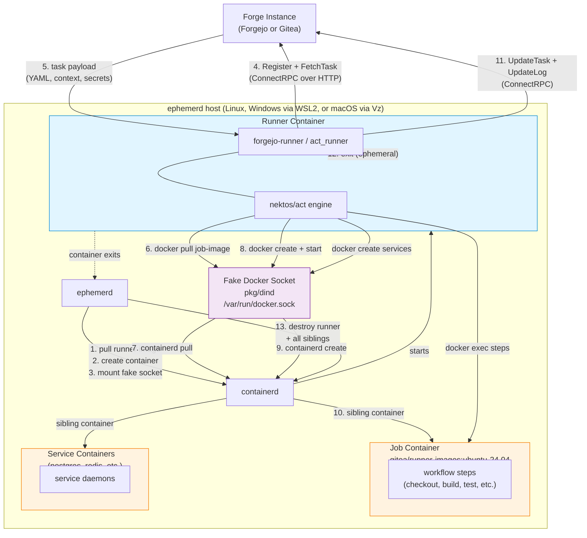
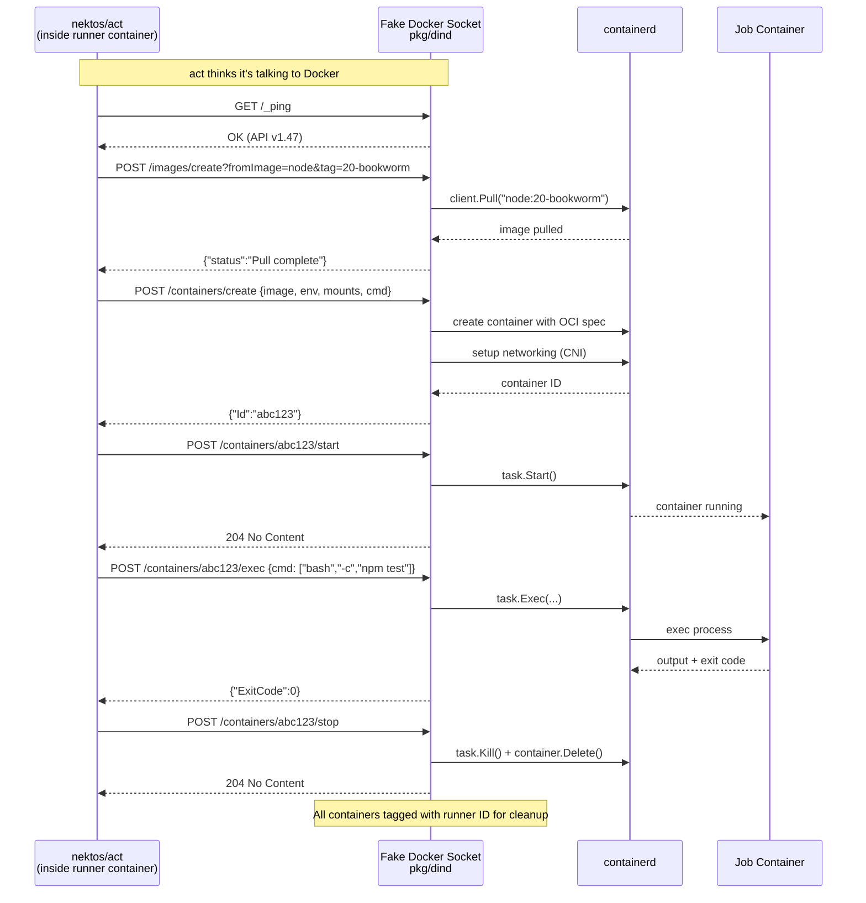
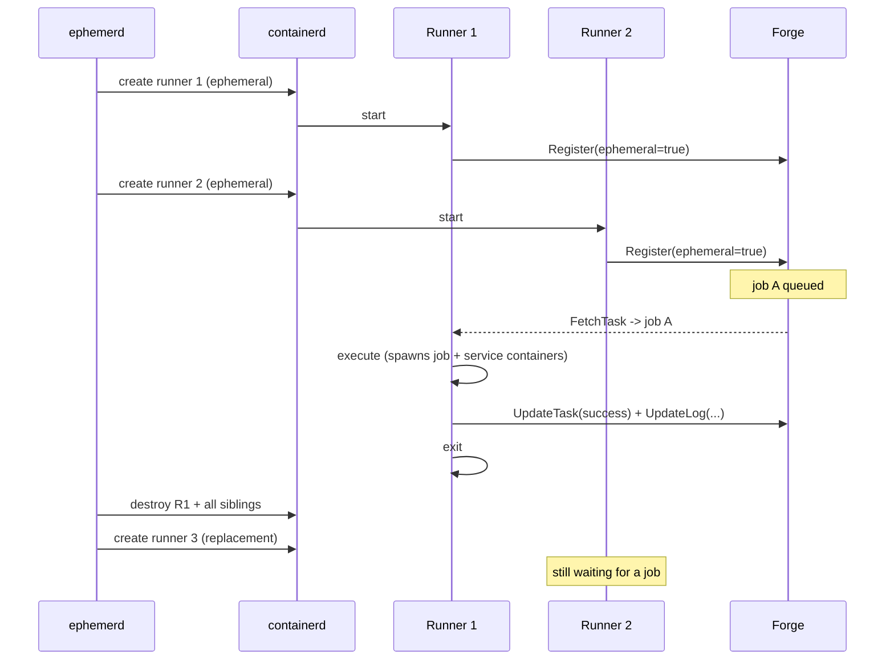

# Forgejo & Gitea Actions Integration

> **Status: Architecture design with provider stubs and e2e tests.** The `pkg/providers/forgejo` and `pkg/providers/gitea` packages exist with e2e test coverage. The Forgejo e2e test boots a full Forgejo instance in Docker and runs a real workflow end-to-end. Full integration with upstream runners in containers is pending.

## Overview

Forgejo and Gitea both descend from the same codebase and share the `runner.v1.RunnerService` ConnectRPC protocol, but their runners have diverged:

| | Forgejo | Gitea |
|---|---|---|
| Runner binary | `forgejo-runner` | `act_runner` |
| Runner image | `data.forgejo.org/forgejo/runner:12` | `docker.io/gitea/act_runner:latest` |
| Proto package | `code.forgejo.org/forgejo/actions-proto` | `code.gitea.io/actions-proto-go` |
| Ephemeral mode | `one-job --handle <uuid>` | `daemon --ephemeral` |
| Job image | `gitea/runner-images:ubuntu-24.04` (community) | `gitea/runner-images:ubuntu-24.04` (official) |
| Multi-task fetch | Yes (batch) | No (single) |
| Official platforms | Linux only | Linux, Windows, macOS |

Both use [nektos/act](https://github.com/nektos/act) forks as the workflow execution engine. The integration model is identical for both — only the binary, image references, and ephemeral invocation differ.

## The Two-Container Model

Unlike GitHub Actions where the runner binary lives *inside* the job container, Forgejo/Gitea runners operate as external **daemons** that create job containers via the Docker API:

```
GitHub Actions:     [ container: runner + job steps ]    (one container)
Forgejo/Gitea:      [ container: runner daemon ] --docker API--> [ container: job steps ]   (two containers)
```

ephemerd exploits this by mounting its **fake Docker socket** (`pkg/dind`) into the runner container. When the runner daemon calls `docker run` to create a job container, the fake socket intercepts the call and translates it to containerd operations. The job container becomes a sibling managed by ephemerd — not a nested container.

## Architecture



### Lifecycle

1. **ephemerd creates the runner container** from the upstream runner image, with the fake Docker socket bind-mounted at `/var/run/docker.sock`. Instance URL, runner token, and labels are passed as env vars.
2. **containerd starts the runner** — on Linux directly, inside WSL2 on Windows, inside the Vz Linux VM on macOS.
3. **Runner registers** with the forge as an ephemeral runner and long-polls `FetchTask`.
4. **Forge returns a task** — workflow YAML bytes, GitHub-style context, secrets, vars.
5. **act parses the workflow** and determines the job image from `runs-on:` label mapping (e.g., `ubuntu-latest` maps to the configured job image).
6. **act calls `docker pull`** for the job image. The fake socket translates this to a containerd pull.
7. **act calls `docker create` + `docker start`** to create the job container. The fake socket translates to containerd container creation. The job container is a **sibling** — a first-class containerd container, not nested.
8. **act calls `docker exec`** for each workflow step inside the job container.
9. **Service containers** (`services:` in the workflow) are created the same way — more siblings via the fake socket.
10. **Runner streams logs** back to the forge via `UpdateLog` and reports status via `UpdateTask`.
11. **Runner exits** because it was ephemeral (Forgejo: `one-job` exits after one task; Gitea: `--ephemeral` exits after one job).
12. **ephemerd detects the exit**, destroys the runner container and all siblings tagged with its ID.

## The Fake Docker Socket in Detail

The fake Docker socket (`pkg/dind`) is a per-job HTTP server that implements a subset of the Docker Engine API. It listens on a Unix socket that is bind-mounted into the runner container at `/var/run/docker.sock`.



### Current Implementation Status

The fake socket in `pkg/dind/dind.go` currently implements health and image operations. Container lifecycle endpoints are needed for full integration:

| Endpoint | Status | Purpose |
|----------|--------|---------|
| `GET /_ping` | Done | Health check, returns API version headers |
| `GET /version` | Done | Returns Docker 27.0.0-ephemerd |
| `GET /info` | Done | Returns daemon info, image count |
| `GET /images/json` | Done | Lists pulled images (in-memory store) |
| `POST /images/create` | Done | Pulls images via containerd |
| `POST /containers/create` | **Not yet** | Translate to containerd container create |
| `POST /containers/{id}/start` | **Not yet** | Translate to containerd task start |
| `POST /containers/{id}/exec` | **Not yet** | Translate to containerd task exec |
| `POST /containers/{id}/stop` | **Not yet** | Translate to containerd task kill |
| `DELETE /containers/{id}` | **Not yet** | Translate to containerd delete |
| `POST /networks/create` | **Not yet** | Translate to CNI network setup |

**To complete the Forgejo/Gitea integration, the container lifecycle endpoints must be implemented.** The image operations are working — the remaining work is container create/start/exec/stop/remove and basic networking. Enable with `dind.enabled = true` in config or `--dind` flag on `serve`.

### Socket Mount

The socket is bind-mounted into the runner container via an OCI spec option:

```
Host:      <DataDir>/jobs/<JobID>/docker/d.sock
Container: /var/run/docker.sock
Mount:     rbind, rw
```

Each job gets its own socket instance. On job cleanup, the socket server is stopped and its directory is removed.

## Runner Pool Model

ephemerd maintains a pool of N ephemeral runner containers (where N = `max_concurrent`). Each registers with the forge, handles one job, and exits. ephemerd replaces it immediately.



### Pool-Based (MVP)

Zero protocol code in ephemerd. The runner handles registration, polling, execution, and reporting. ephemerd just manages container lifecycle.

- Pros: simple, matches how most people deploy today
- Cons: N idle runner containers when no jobs are queued (minimal cost — runner images are ~18MB)

### Demand-Based (Future)

ephemerd implements a lightweight FetchTask poller (~100 lines of ConnectRPC client) to detect pending jobs, then spawns runners on demand. No idle containers. Requires the protocol client but avoids standing containers.

## Configuration

```toml
# Forgejo
[forgejo]
instance_url = "https://codeberg.org"
token = "runner-registration-token"    # from admin > Actions > Runners
owner = "your-org"
# repos = ["repo1", "repo2"]          # optional, omit for all repos
# job_image = "gitea/runner-images:ubuntu-24.04"  # default job execution image

# Gitea (mutually exclusive with [forgejo])
[gitea]
instance_url = "https://gitea.example.com"
token = "runner-registration-token"
owner = "your-org"
# repos = ["repo1", "repo2"]
# job_image = "gitea/runner-images:ubuntu-24.04"

[runner]
max_concurrent = 4  # pool size
```

### Label Mapping

The runner registers with labels that map `runs-on:` values to Docker images. The `job_image` config sets the default:

```
ubuntu-latest:docker://<job_image>
```

When a workflow specifies `runs-on: ubuntu-latest`, the runner creates a job container from the configured job image. Custom images can be specified per-label in future config.

### Provider Auto-Detection

The `Config.Provider()` method detects which forge is configured:

```
[forgejo] instance_url set → "forgejo"
[gitea]   instance_url set → "gitea"
[gitlab]  instance_url set → "gitlab"
(default)                  → "github"
```

## Host OS Support (Linux Jobs)

Today, Forgejo/Gitea Actions is a **Linux-jobs-only** ecosystem. `runs-on: ubuntu-latest` works; `windows-latest` and `macos-latest` don't exist in the runner label ecosystem.

This is fine for ephemerd: on all three host OSes, the runner is always a Linux container:

| Host OS | How Linux containers run | Runner image |
|---------|-------------------------|--------------|
| Linux | Direct containerd | Same |
| Windows | containerd inside WSL2 | Same |
| macOS | containerd inside Vz Linux VM | Same |

Users don't need Docker, Podman, or any VM tool — ephemerd brings its own containerd and VM infrastructure.

## Future: forge-runner and Multi-OS Support

The two-container model (runner daemon + job container via fake Docker socket) works for Linux jobs today, but it's a dead end for Windows and macOS:

- **nektos/act only creates Linux Docker containers.** There is no Windows or macOS container support in act.
- **act's "host mode"** runs steps directly on the OS without isolation — unusable for ephemerd.
- **The fake Docker socket** would need full container lifecycle endpoints that don't exist yet.

The real solution is to **replace act** with a new runner that works like the GitHub Actions runner: a single binary that runs inside the container/VM, executes steps via direct process spawning, and reports back to the forge. No Docker-in-Docker, no two-container model.

See **[forge-runner.md](forge-runner.md)** for the full design spec.

### forge-runner in Brief

```
act-based (current):    [ runner daemon ] --docker API--> [ job container ]
forge-runner (future):  [ single container/VM with forge-runner + steps ]
```

forge-runner is a Go binary that:
- Speaks the Forgejo/Gitea ConnectRPC protocol (Register, FetchTask, UpdateTask, UpdateLog)
- Uses act's YAML parser (`pkg/model`) and expression evaluator (`pkg/exprparser`) as Go libraries
- Executes steps via direct `os/exec` process spawning (bash, pwsh, node) — no Docker
- Cross-compiles for Linux, Windows, and macOS

This gives us the **same single-container model** as GitHub Actions on all platforms:

```mermaid
flowchart TB
    subgraph FUTURE ["forge-runner: Single Container/VM per Platform"]
        direction TB

        subgraph LIN ["Linux"]
            E1[ephemerd] -->|containerd| C1["Container<br/>forge-runner + Ubuntu tools"]
            C1 -->|"bash steps"| S1["workflow steps"]
        end

        subgraph WIN ["Windows"]
            E2[ephemerd.exe] -->|"Hyper-V container"| C2["Container<br/>forge-runner.exe + Server Core"]
            C2 -->|"pwsh steps"| S2["workflow steps"]
        end

        subgraph MAC ["macOS"]
            E3[ephemerd] -->|"Vz VM (APFS clone)"| C3["macOS VM<br/>forge-runner + Xcode"]
            C3 -->|"bash steps"| S3["workflow steps"]
        end
    end

    style LIN fill:#e8f5e9,stroke:#388e3c
    style WIN fill:#e3f2fd,stroke:#1565c0
    style MAC fill:#fce4ec,stroke:#c62828
```



### Implementation Phases

**Phase 1: Linux jobs with upstream runners (current work)**
- Two-container model with `forgejo-runner`/`act_runner` + fake Docker socket
- Works on all host OSes via Linux containers
- Validates the provider interface, config, and scheduler integration

**Phase 2: forge-runner for Linux**
- New Go binary, ~2,100 lines (see [forge-runner.md](forge-runner.md) for breakdown)
- Single-container model replaces the two-container approach
- Embedded in ephemerd like the GHA runner (extract + bind-mount)
- Eliminates dependency on fake Docker socket container lifecycle endpoints

**Phase 3: forge-runner for Windows**
- Cross-compile for `GOOS=windows`
- Mount into Hyper-V containers (same pattern as GHA runner on Windows)
- PowerShell as default shell
- Reuses all existing Windows container infrastructure

**Phase 4: forge-runner for macOS**
- Cross-compile for `GOOS=darwin GOARCH=arm64`
- Pre-install in macOS VM base image
- Reuses all existing Vz VM infrastructure

## Comparison to GitHub Integration

| Aspect | GitHub | Forgejo/Gitea (Phase 1) | Forgejo/Gitea (forge-runner) |
|--------|--------|------------------------|------------------------------|
| Runner binary | `actions/runner` (embedded) | `forgejo-runner` / `act_runner` (from image) | `forge-runner` (embedded) |
| Container model | One container | Two containers (runner + job) | One container |
| Docker socket | Fake socket for workflow `docker run` | Fake socket for act's job containers | Fake socket for workflow `docker run` only |
| Registration | Per-job JIT config | Ephemeral at register time | Ephemeral at register time |
| Discovery | ephemerd polls or webhook | Runner polls forge | forge-runner polls forge |
| Execution engine | GHA runner (C#, closed source) | nektos/act (Go, open source) | forge-runner (Go, direct exec) |
| Job image | `ghcr.io/actions/actions-runner:latest` | `gitea/runner-images:ubuntu-24.04` | `ghcr.io/ephpm/forge-runner:ubuntu-24.04` |
| Supported job OS | Linux, Windows, macOS | Linux only | Linux, Windows, macOS |

## What Stays the Same Across Providers

- Container runtime (`pkg/runtime`) — provider-agnostic
- WSL2 dispatch (Linux jobs on Windows) — orthogonal to CI provider
- Networking (CNI on Linux, HCN on Windows) — unchanged
- containerd management — unchanged
- gRPC control plane (status, jobs, drain) — unchanged
- Concurrency limiting, dedup, graceful drain — unchanged
- macOS VM lifecycle — unchanged
