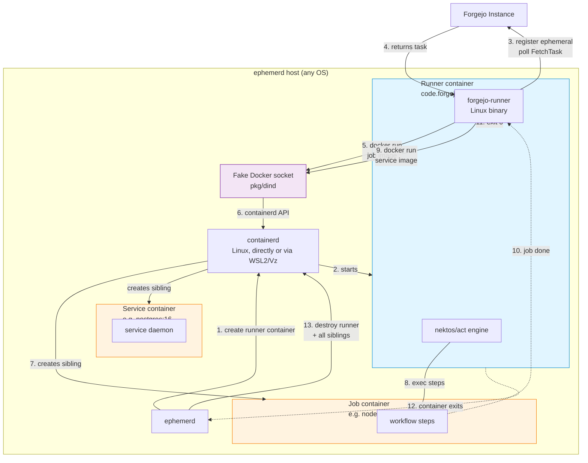
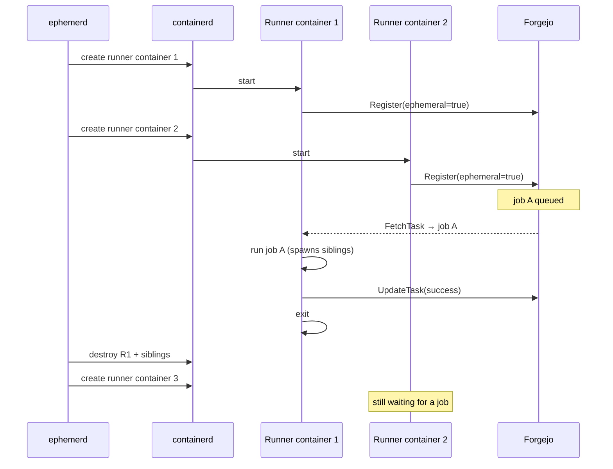

# Forgejo / Gitea Integration

> **Status: Architecture design.** The `pkg/providers/forgejo` package is a stub. This document describes the intended implementation.

## Overview

Forgejo and Gitea use the same `runner.v1.RunnerService` Connect-RPC protocol. The official runners (`forgejo-runner`, `act_runner`) are Linux Go binaries built around the `nektos/act` workflow engine. Forgejo/Gitea Actions is a **Linux-jobs-only** ecosystem today — `runs-on: ubuntu-latest` works, `windows-latest` and `macos-latest` don't exist.

Ephemerd integrates by running the official runner **inside an ephemerd-managed Linux container** on every host OS. No reimplementation, no embedded runner binary rewrite, no new runner project required.

## The Two-Layer Architecture

The key insight: ephemerd is already the host-side orchestrator. The runner is just the in-container executor. One Linux runner binary is sufficient for all three host OSes.

```
┌───────────────────────────────────────────────────────┐
│  Layer 1 — Host orchestrator (platform-native)        │
│  Creates Linux containers; manages their lifecycle    │
│  ──────────────────────────────────────────────────   │
│  ephemerd (Linux) — uses containerd directly          │
│  ephemerd.exe (Windows) — containerd inside WSL2      │
│  ephemerd (macOS) — containerd inside a Vz Linux VM   │
└────────────────────────┬──────────────────────────────┘
                         │
                         │  creates Linux containers
                         │  (always Linux, regardless
                         │   of host OS)
                         ▼
┌───────────────────────────────────────────────────────┐
│  Layer 2 — Container executor (Linux)                 │
│  Polls Forgejo, executes workflow steps via act       │
│  ──────────────────────────────────────────────────   │
│  forgejo-runner (linux-amd64 / linux-arm64)           │
│  Same Linux binary on every host OS                   │
└───────────────────────────────────────────────────────┘
```

In every case, the container is Linux. On Windows it's a Linux container running inside WSL2. On macOS it's a Linux container inside the Virtualization.framework Linux VM. On Linux it's a direct containerd Linux container.

This means **we never need Windows/macOS builds of forgejo-runner**. The "platform gap" where forgejo-runner only ships Linux binaries doesn't affect ephemerd — the host-side work is already done by ephemerd itself. A user running `ephemerd.exe` on Windows doesn't need Docker Desktop, Podman, or any other VM tool. Ephemerd brings its own WSL2 rootfs, its own containerd, and (via this integration) the Linux forgejo-runner binary.

### User experience

```toml
[forgejo]
instance_url = "https://codeberg.org"
token = "runner-registration-token"
owner = "your-org"
```

That's the whole setup on any OS. Ephemerd handles WSL2/Vz/containerd. The runner image is pulled (or bundled, TBD) and the runner starts executing jobs.

## Job Lifecycle: The Fake Docker Socket

Inside the runner container, `nektos/act` (embedded in forgejo-runner) wants to call `docker run` to create a container for each job. Ephemerd mounts its fake Docker socket (`pkg/dind`) — the same one already used for jobs that do `docker run` as a workflow step — so act's Docker API calls get translated to containerd operations.



### Flow explained

1. **ephemerd creates the runner container** from the forgejo-runner image, with the fake Docker socket mounted at `/var/run/docker.sock`. Registration token and instance URL passed as env vars.
2. **containerd starts the runner container** (on Linux directly, inside WSL2 on Windows, inside the Vz VM on macOS).
3. **forgejo-runner registers** with Forgejo using `ephemeral=true`, then long-polls `FetchTask`.
4. **Forgejo returns a task** — workflow YAML, context, secrets, vars.
5. **act calls `docker run`** to create a container for the job. Call hits the fake socket.
6. **Fake socket translates** to containerd API calls on the host.
7. **containerd creates the job container** as a sibling to the runner container (not nested — both are first-class containers).
8. **act execs each step** inside the job container.
9. **Service containers** from `services:` are spawned the same way — more siblings via the fake socket.
10. **Job completes.**
11. **forgejo-runner exits** because it was ephemeral (one job, then done).
12. **Runner container exits**, ephemerd detects it.
13. **ephemerd destroys everything** — runner, job container, service containers. All sibling containers are tagged with the runner's ID, so cleanup is a single step.

## Why This Works Without New Code

| Concern | How it's handled |
|---|---|
| Workflow parsing | `nektos/act` inside `forgejo-runner` (existing) |
| Expression evaluation `${{ }}` | `nektos/act` (existing) |
| Action resolution `uses: ...` | `nektos/act` (existing) |
| Job container creation | Fake Docker socket → containerd (existing `pkg/dind`) |
| Runner registration | `forgejo-runner` Register RPC (existing) |
| Task discovery | `forgejo-runner` FetchTask polling (existing) |
| Log streaming | `forgejo-runner` UpdateLog RPC (existing) |
| Cross-host (Windows/macOS) | Runner is always in a Linux container (ephemerd's existing WSL2/Vz setup) |
| Isolation | ephemerd's container boundary (existing `pkg/runtime`) |
| Cleanup | ephemerd destroys runner + all siblings (existing logic) |

Nothing in this list is new work. The Forgejo provider in `pkg/providers/forgejo/` is just glue:

- On `ClaimJob`: return a `Claim` describing a runner container to create (image, registration token env, fake socket mount)
- Scheduler creates the container, starts it, waits for exit
- On exit: destroy runner + all siblings it spawned

## Runner Pool Model

Unlike GitHub's per-job JIT runners, Forgejo's `ephemeral=true` just means "accept one job matching my labels, then exit." It's not job-specific.

### Pool-based (recommended for MVP)

Ephemerd maintains N ephemeral runner containers (where N = `max_concurrent`). Each:

- Registers with Forgejo as ephemeral
- Waits for a matching job
- Runs it
- Exits

When a runner exits, ephemerd spawns a replacement.



Pros: zero protocol code in ephemerd, trivially parallel, matches how most people deploy forgejo-runner today.

Cons: N standing runner containers even when idle (small cost — runner containers are lightweight).

### Demand-based (later phase)

Ephemerd implements a small FetchTask poller (~100 lines of protocol client) to detect pending jobs, then spawns runner containers on demand. No idle containers. Requires the protocol client. Not needed for MVP.

## Cleanup Semantics

Every container created during a job — runner, job, services — is a first-class containerd container on the host. Sibling containers spawned through the fake Docker socket are tagged with the originating runner's ID.

When the runner container exits (cleanly or not), ephemerd:

1. Lists siblings tagged with this runner's ID
2. Stops them with a grace period
3. Destroys snapshots
4. Releases network namespaces

Same cleanup flow we already use for GitHub jobs that spawn Docker sidecars. On crash recovery, `rt.CleanOrphans` at startup sweeps up any dangling siblings from a previous crash.

## Platform Support: Linux Jobs Only

Forgejo/Gitea Actions is Linux-jobs-only today. `nektos/act` has no Windows Server container or macOS support — it only knows how to execute workflows in Linux containers. `runs-on: windows-latest` and `runs-on: macos-latest` are not part of the ecosystem.

This is fine for ephemerd: on all three host OSes, ephemerd runs jobs in Linux containers. The host OS is irrelevant to the runner binary, which is always the Linux build.

**Windows-native and macOS-native jobs stay GitHub-only** until the Forgejo/Gitea ecosystem builds multi-OS runners. That's a large project (extending act to handle Windows container lifecycle, PowerShell step execution, Windows path semantics, Windows image mapping, etc.) and not something ephemerd needs to solve to ship Forgejo/Gitea support.

## Comparison to GitHub

| Aspect | GitHub | Forgejo/Gitea |
|---|---|---|
| Runner binary | `actions/runner` (embedded in ephemerd) | `forgejo-runner` / `act_runner` (from image) |
| Registration | Per-job JIT config | Ephemeral at register time |
| Discovery | ephemerd polls or webhook | forgejo-runner polls (MVP) or ephemerd polls (later) |
| Execution engine | GitHub's runner (opaque binary) | `nektos/act` (inside forgejo-runner) |
| Job container | Runner creates it if `container:` used | act creates it via fake Docker socket |
| Supported job OS | Linux, Windows, macOS | **Linux only** (ecosystem limitation) |
| Host OS support | Linux, Windows, macOS | Linux, Windows, macOS (all run Linux jobs) |

## Configuration

```toml
[forgejo]
instance_url = "https://codeberg.org"
token = "runner-registration-token"
owner = "your-org"
# repos = ["repo1", "repo2"]  # optional, omit for all repos

[runner]
max_concurrent = 4  # size of the ephemeral runner pool
```

Ephemerd will:
- Spawn 4 ephemeral runner containers on startup
- Each registers with Forgejo
- Each handles one job and exits
- Ephemerd replaces each one as it exits

Same config works identically on Linux, Windows (via WSL2), and macOS (via Vz). Users don't need Docker, Podman, or any VM management tool installed — ephemerd brings its own.

## Open Questions

- **Runner image distribution**: pull `code.forgejo.org/forgejo/runner:6` at first job? Pre-embed in ephemerd binary (like the GHA runner)? Bundle in a default ephemerd container image?
- **Label mapping**: how do workflow `runs-on:` labels map to job container images? Likely a config map: `ubuntu-latest → docker://node:20-bookworm`.
- **Gitea parity**: same approach applies — swap `forgejo-runner` for `act_runner`. Identical protocol, identical container-image model.
