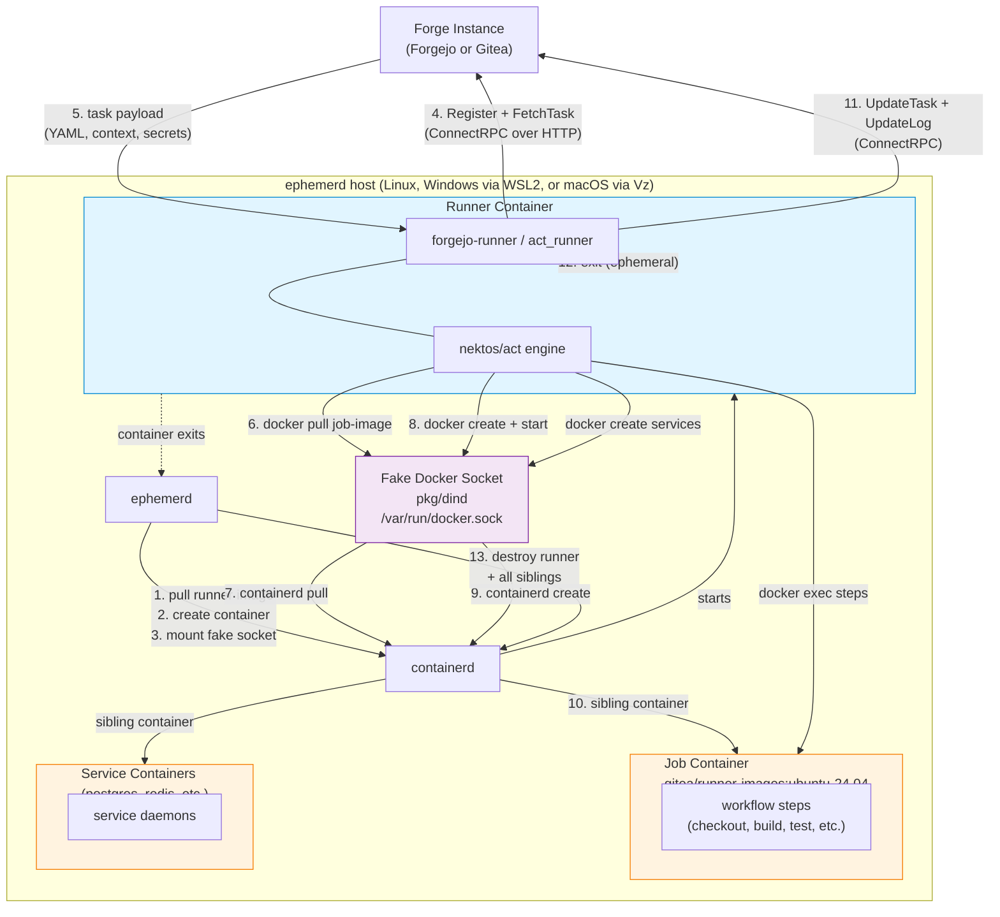
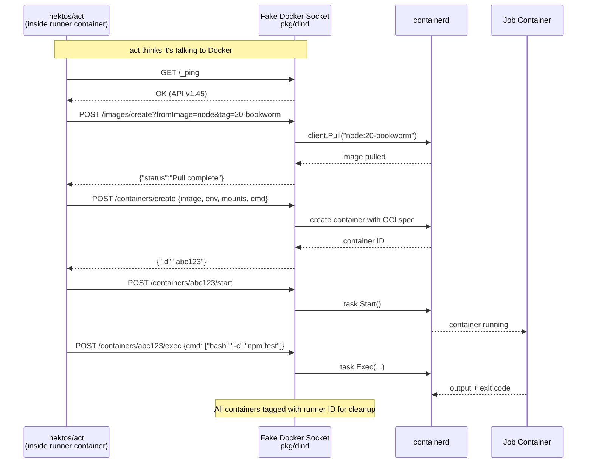
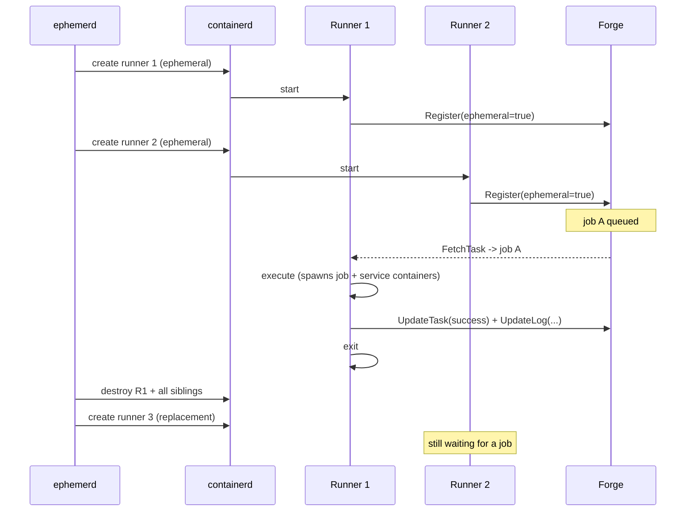

Forgejo and Gitea both descend from the same codebase and share the `runner.v1.RunnerService` ConnectRPC protocol, but their runners have diverged. ephemerd supports both through the same two-container model.

> **Status:** Architecture design with provider stubs and e2e tests. Full integration with upstream runners in containers is pending.

## Runner Comparison

| | Forgejo | Gitea |
|---|---|---|
| Runner binary | `forgejo-runner` | `act_runner` |
| Runner image | `data.forgejo.org/forgejo/runner:12` | `docker.io/gitea/act_runner:latest` |
| Proto package | `code.forgejo.org/forgejo/actions-proto` | `code.gitea.io/actions-proto-go` |
| Ephemeral mode | `one-job --handle <uuid>` | `daemon --ephemeral` |
| Job image | `gitea/runner-images:ubuntu-24.04` | `gitea/runner-images:ubuntu-24.04` |

Both use [nektos/act](https://github.com/nektos/act) forks as the workflow execution engine. The integration model is identical for both -- only the binary, image references, and ephemeral invocation differ.

## The Two-Container Model

Unlike GitHub Actions where the runner binary lives inside the job container, Forgejo/Gitea runners operate as external daemons that create job containers via the Docker API:

```
GitHub Actions:     [ container: runner + job steps ]          (one container)
Forgejo/Gitea:      [ container: runner daemon ] --Docker API--> [ container: job steps ]   (two containers)
```

ephemerd exploits this by mounting its [fake Docker socket]() (`pkg/dind`) into the runner container. When the runner daemon calls `docker run` to create a job container, the fake socket intercepts the call and translates it to containerd operations. The job container becomes a sibling managed by ephemerd -- not a nested container.

## Architecture



### Lifecycle

1. ephemerd creates the runner container from the upstream runner image, with the fake Docker socket bind-mounted at `/var/run/docker.sock`.
2. containerd starts the runner -- on Linux directly, inside WSL2 on Windows, inside the Vz Linux VM on macOS.
3. Runner registers with the forge as an ephemeral runner and long-polls `FetchTask`.
4. Forge returns a task -- workflow YAML bytes, context, secrets, vars.
5. act parses the workflow and determines the job image from `runs-on:` label mapping.
6. act calls `docker pull` for the job image. The fake socket translates this to a containerd pull.
7. act calls `docker create` + `docker start`. The fake socket creates a sibling containerd container.
8. act calls `docker exec` for each workflow step inside the job container.
9. Service containers (`services:` in the workflow) are created the same way -- more siblings.
10. Runner streams logs back to the forge via `UpdateLog` and reports status via `UpdateTask`.
11. Runner exits because it was ephemeral.
12. ephemerd detects the exit, destroys the runner container and all siblings.

## Fake Docker Socket Integration



## Runner Pool Model

ephemerd maintains a pool of N ephemeral runner containers (where N = `max_concurrent`). Each registers with the forge, handles one job, and exits. ephemerd replaces it immediately.



### Pool-Based (Current)

Zero protocol code in ephemerd. The runner handles registration, polling, execution, and reporting. ephemerd just manages container lifecycle.

- Pros: simple, matches how most people deploy today.
- Cons: N idle runner containers when no jobs are queued (minimal cost -- runner images are ~18MB).

### Demand-Based (Future)

ephemerd implements a lightweight FetchTask poller to detect pending jobs, then spawns runners on demand. No idle containers. Requires the protocol client but avoids standing containers.

## Host OS Support

Forgejo/Gitea Actions is a Linux-jobs-only ecosystem today. On all three host OSes, the runner is always a Linux container:

| Host OS | How Linux containers run |
|---------|-------------------------|
| Linux | Direct containerd |
| Windows | containerd inside WSL2 |
| macOS | containerd inside Vz Linux VM |

## Configuration

```toml
# Forgejo
[forgejo]
instance_url = "https://codeberg.org"
token = "runner-registration-token"    # from admin > Actions > Runners
owner = "your-org"
# repos = ["repo1", "repo2"]          # optional, omit for all repos
# job_image = "gitea/runner-images:ubuntu-24.04"

# Gitea (mutually exclusive with [forgejo])
[gitea]
instance_url = "https://gitea.example.com"
token = "runner-registration-token"
owner = "your-org"

[runner]
max_concurrent = 4  # pool size
```

## ephemerd-runner-forgejo (implemented)

The two-container model works for Linux jobs but is a dead end for Windows and macOS — nektos/act only creates Linux Docker containers. **ephemerd-runner-forgejo** replaces it with a single-container model: a Go binary that speaks the Forgejo/Gitea ConnectRPC protocol directly, executes steps via `os/exec` process spawning (no Docker), and cross-compiles for all platforms.

See [ephemerd-runner-forgejo architecture]() for the full design.
