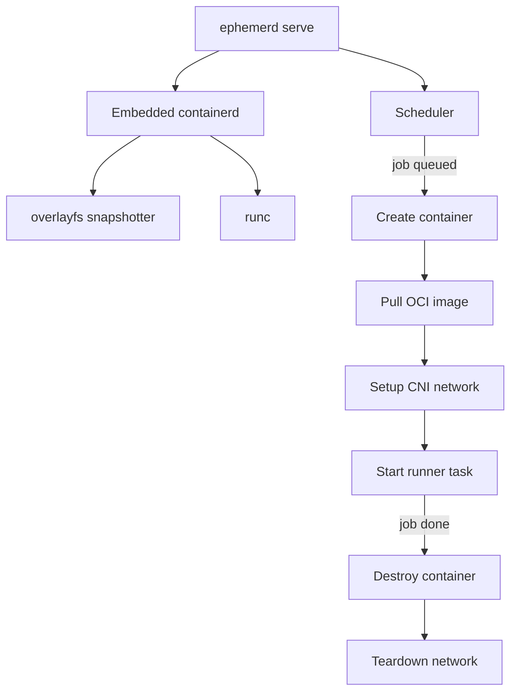
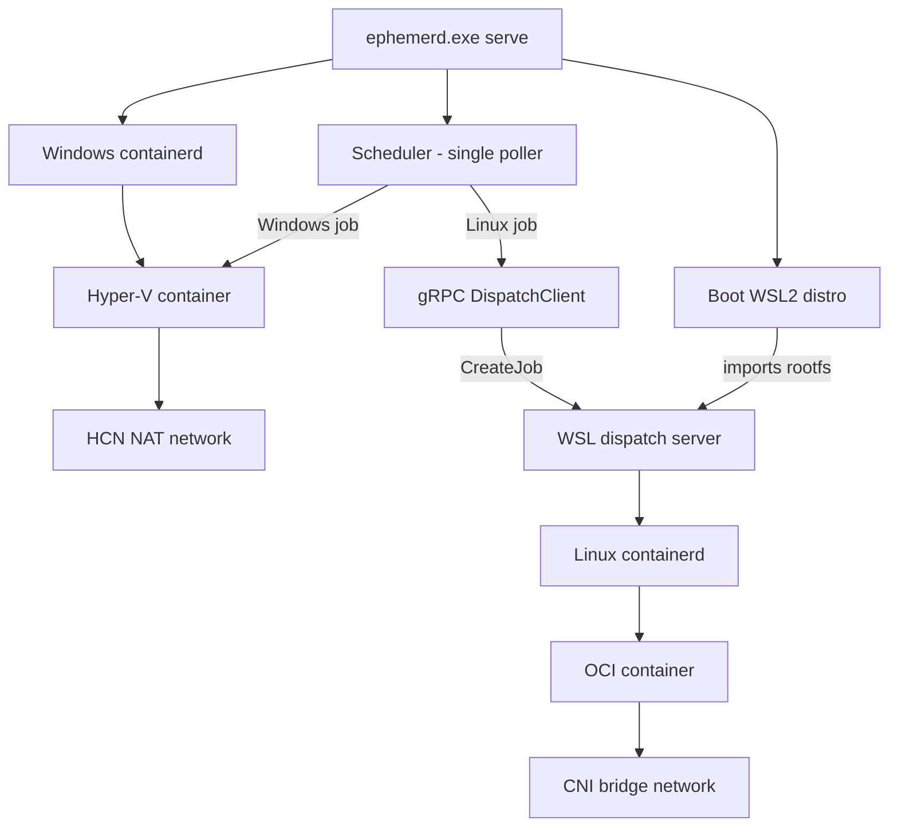
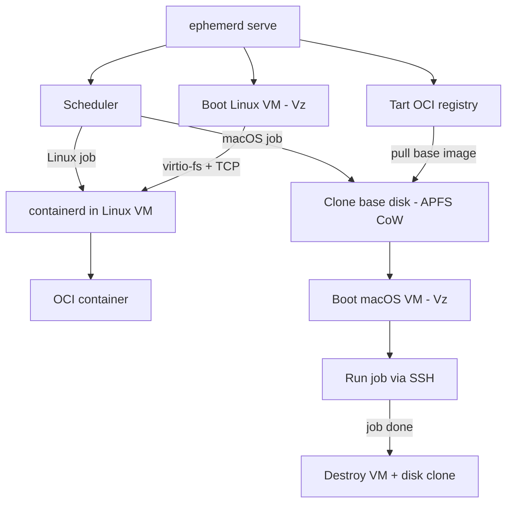

ephemerd is a single binary that manages ephemeral CI/CD environments. Each job gets a fresh, isolated environment that is destroyed on completion. The way it achieves this differs by host platform.

## Platform Models

### Linux

On Linux, ephemerd runs containerd as an in-process Go library (the same approach k3s uses). Jobs run as standard OCI containers with overlayfs snapshots. This is the fastest path -- container startup takes roughly one second.

Both x86_64 and arm64 are supported. The embedded containerd uses runc as the low-level runtime and CNI bridge networking for container connectivity.



### Windows

On Windows, ephemerd manages two types of jobs from a single process:

- **Windows jobs** run as Hyper-V isolated containers. Each container gets its own Windows kernel, providing strong isolation. The embedded containerd talks to the HCS (Host Compute Service) via the runhcs shim.
- **Linux jobs** are dispatched to a WSL2 distro via gRPC. The WSL distro runs a second copy of ephemerd (cross-compiled for Linux and embedded in the Windows binary) with its own containerd instance.

A single scheduler on the Windows host polls GitHub for all jobs and routes them by OS label. The WSL worker has no GitHub credentials and no scheduler -- it only runs containers on demand.



The WSL distro is created from an embedded Alpine rootfs with gcompat and iptables pre-installed. The Linux ephemerd binary runs from `/mnt/c/` (the Windows disk mount) to avoid the slow 9P filesystem copy into WSL. On shutdown, the distro is unregistered and destroyed.

### macOS

On macOS (Apple Silicon), ephemerd uses Virtualization.framework to run two types of VMs:

- **Linux jobs** run inside a lightweight Alpine VM with containerd, identical to the native Linux path. The same OCI images work on every host.
- **macOS jobs** run in per-job APFS clone-on-write VMs. Each job gets a copy of a base macOS disk image that is discarded after the job completes.

The host communicates with the Linux VM over virtio-fs (shared filesystem) and TCP (containerd gRPC). macOS VMs get an ephemeral SSH key injected for host-to-VM communication.



Base macOS images are pulled from a Tart-compatible OCI registry. APFS clone-on-write means creating a per-job copy is nearly instant and uses minimal disk space -- only blocks that the job modifies are allocated.

## Dual-Purpose Hosts

Every supported host can run both its native jobs and Linux jobs:

| Host OS | Linux jobs | Native jobs |
|---------|-----------|-------------|
| **Linux** | OCI containers (direct) | OCI containers (direct) |
| **Windows** | OCI containers (via WSL2) | Hyper-V containers |
| **macOS** | OCI containers (via Vz Linux VM) | APFS clone-on-write macOS VMs |

This means a single ephemerd host can serve workflows that need both Linux and native platform steps.

### Resource planning for VMs

On Windows and macOS, the `max_concurrent` setting applies globally — Linux container jobs and native OS jobs share the same concurrency pool. All Linux container jobs run inside a single VM (WSL2 on Windows, Virtualization.framework on macOS), so if `max_concurrent = 4`, that one VM could be running up to 4 concurrent jobs.

Size the Linux VM resources accordingly:

```toml
[runner]
max_concurrent = 4

[vm.linux]
cpus = 4          # at least 1 per concurrent job
memory_mb = 8192  # at least 2GB per concurrent job
```

If the VM is undersized, jobs will compete for CPU and memory and slow each other down. On Linux hosts this isn't an issue — containers run directly on the host with access to all host resources.

## One Image, Every Host

The same Dockerfile produces an image that runs on all three platforms. ephemerd always uses containerd to run Linux OCI containers -- whether that containerd is running natively (Linux), inside WSL2 (Windows), or inside a Virtualization.framework VM (macOS). The container runtime is identical in all cases.

```yaml
jobs:
  build:
    runs-on: [self-hosted, linux, x64]
    container: ghcr.io/your-org/ci-image:latest
    steps:
      - uses: actions/checkout@v4
      - run: make test
```

This workflow runs unchanged on a Linux server, a Windows workstation, or a Mac mini. The container image is pulled and executed by containerd regardless of the host OS.

## OCI Images as Artifact Cache

On macOS, jobs that need pre-built tools or large dependencies can package them as OCI images. ephemerd pulls the image via containerd (which caches layers) and extracts the filesystem layers into a host directory shared with the macOS VM via virtio-fs.

This turns any OCI registry into an artifact cache. A `FROM scratch` image containing compiled tools or SDK installations can be built once, pushed to a registry, and unpacked into every macOS VM job that needs it -- without re-downloading or re-building.

```dockerfile
FROM scratch
COPY --from=builder /opt/sdk /opt/sdk
```

Set `EPHEMERD_IMAGE` in your workflow to trigger extraction:

```yaml
jobs:
  build:
    runs-on: [self-hosted, macos]
    env:
      EPHEMERD_IMAGE: ghcr.io/your-org/macos-sdk-cache:latest
    steps:
      - run: ls /opt/sdk   # extracted artifacts available here
```
