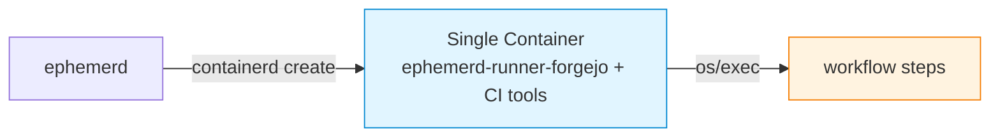
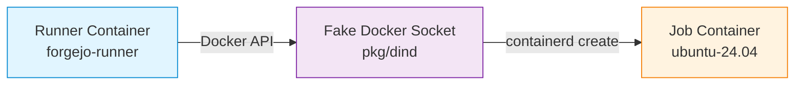

ephemerd uses OCI container images to define the execution environment for each job. The image determines what tools, runtimes, and system packages are available during the workflow run.

## GitHub Actions

### How it works

GitHub Actions jobs run inside a single container: ephemerd pulls the image, starts a container, and the Actions runner inside it picks up the job. **The image does not have to contain the runner.** ephemerd ships the Actions runner archive inside its own binary (`//go:embed all:embed` — `pkg/runner/runner.go:18`), extracts it once onto the host under `<data-dir>/runners/<version>-<goos>` (`pkg/runner/runner.go:64`, path at `runner.go:43`), makes a per-job copy (`pkg/runtime/runtime.go:952`), and bind-mounts that copy into the container at `/actions-runner` — `rbind,rw` on Linux, a mapped directory on Windows (`pkg/runtime/runtime.go:1514`).

There are exactly two paths, chosen by the image reference:

| Image | Runner comes from | Entrypoint |
|-------|-------------------|------------|
| A recognized official runner ref (`ghcr.io/actions/actions-runner:*`, `ghcr.io/actions/runner-images-runner:*`, `ephpm/ephemerd:runner-ci-linux*`) | the image itself | `/home/runner/run.sh` |
| **Anything else** | bind-mounted by ephemerd at `/actions-runner` | `/actions-runner/run.sh` |

The branch is `customImage := image != "" && !isOfficialRunnerImage(image)` (`pkg/runtime/runtime.go:805`); the allowlist is `isOfficialRunnerImage` (`pkg/runtime/runtime.go:1660`), the entrypoint switch is `runtime.go:856-863`, and the mount decision is `runtime.go:937`.

Note that the recognized-official case is the *special* one. The general case — a stock image with no runner in it — is the path everything else takes, and it is exercised by ephemerd's own Windows default (see below).

### Default images

| Platform | Default image | Contains a runner? |
|----------|--------------|--------------------|
| Linux | `ghcr.io/actions/actions-runner:latest` | Yes (`pkg/runtime/runtime.go:42`) |
| Windows | `mcr.microsoft.com/windows/servercore:ltsc20XX` (auto-detected) | **No** (`pkg/runtime/image_windows.go:9-13`) |

The Windows default is a stock Microsoft Server Core image with no Actions runner
in it at all. Every Windows job on ephemerd is already running the "stock image"
path — the runner is mounted in at `C:\actions-runner` and started via
`C:\actions-runner\run.cmd` (`pkg/runtime/runtime.go:858`).

It also ships **no Docker CLI**. Server Core is a bare OS image, and ephemerd
does not add a `docker` client to it, so on the auto-detected Windows default
there is no `docker` command available to job steps. Anything that shells out to
`docker` — a `docker build`/`docker run` step, `docker/setup-buildx-action` —
will not find it. If you need a Docker CLI on Windows, bring your own image and
install it; ephemerd's own `runner-ci-windows` image does exactly that
(`images/runner-ci-windows/Dockerfile:86-89` installs `docker.exe` into
`C:\go\bin`, which is on `PATH` via line 79).

### Specifying an image

Use the `container:` key in your workflow YAML:

```yaml
jobs:
  build:
    runs-on: [self-hosted, linux, x64]
    container: ghcr.io/your-org/ci-image:latest
    steps:
      - uses: actions/checkout@v4
      - run: make test
```

### Use a stock image

Reach for an off-the-shelf image before you build one. A plain upstream image
works as a job container as-is — it does not need to derive from
`ghcr.io/actions/actions-runner`, or from anything else:

```yaml
jobs:
  build:
    runs-on: [self-hosted, linux]
    container: golang:1.26.6-bookworm
    steps:
      - uses: actions/checkout@v4
      - run: go build ./...
```

Two things this buys you, both verified in practice with
`golang:1.26.6-bookworm`:

- **One tag, both architectures.** `golang:1.26.6-bookworm` is a multi-arch
  manifest, so the same tag resolves to arm64 natively on an arm64 host and
  amd64 on an amd64 host. You do not need per-arch tags, a matrix over
  architectures, or a `docker buildx` pipeline of your own to get arm64
  coverage.
- **Delete your toolchain-install steps.** A stock language image already has
  the toolchain, and on Debian-family images it already has a C toolchain and
  headers too. Installing a compiler at job time — the usual
  `apt-get install build-essential` step, or a `setup-*` action fetching an SDK
  — is pure per-job cost that a stock image removes outright.

Custom images are for caching build *dependencies* (see
[Reference: ephemerd CI Images](#reference-ephemerd-ci-images)), not for
supplying the runner.

### What the image actually has to provide

Nothing runner-related. What the runner needs from the image is a place to run:

**Linux**

- **`/bin/bash`.** The runner's `run.sh` and `run-helper.sh` are
  `#!/bin/bash`, and ephemerd execs `/actions-runner/run.sh --jitconfig ...`
  directly (`pkg/runtime/runtime.go:930`). An image with only `/bin/sh` — a
  BusyBox/Alpine image — will not start the runner.
- **A glibc userland with the runner's shared libraries.** The runner is a
  .NET application; upstream's `installdependencies.sh` requires
  `libkrb5-3`, `zlib1g`, `liblttng-ust`, `libssl`, and `libicu`. Debian- and
  Ubuntu-family images (including `golang:*-bookworm`) satisfy this. **musl
  images (Alpine) do not** — this is the single most common reason a stock
  image fails to start.
- **Standard coreutils** on `PATH`: `dirname`, `readlink`, `pwd`, `cp`, `id`.
- **CA certificates**, so the runner can reach the forge over HTTPS. Present in
  every mainstream base image; the thing to watch for is a hand-rolled
  `FROM scratch` image.
- **Not Node.js.** The runner bundles its own `node20` under
  `externals/` (`run.sh` execs `./externals/node20/bin/node`), which comes in
  with the mount. You do not need Node in the image — but note that bundled
  `node` is glibc-linked too, which is the other half of the musl problem
  above.

ephemerd sets the container's process args directly and never wraps them in
`sh -c` (`pkg/runtime/runtime.go:930`), so the entrypoint is `execve`d as-is.
That is why a missing `/bin/bash` shows up as an immediate startup failure
rather than a script error.

Everything else is left to the image. ephemerd sets no `USER` and no
`WORKDIR` on the container — `oci.WithImageConfig` carries the image's own
values through (`pkg/runtime/runtime.go:881`), and `RUNNER_ALLOW_RUNASROOT=1`
is set (`runtime.go:874`) so running as root, which most stock images do, is
fine. The bind at `/actions-runner` is created by the runtime, so the image
does not need that directory to exist.

Two limits worth knowing:

- **Capabilities are restricted** to a CI-shaped set — `CAP_CHOWN`,
  `CAP_DAC_OVERRIDE`, `CAP_FOWNER`, `CAP_FSETID`, `CAP_KILL`, `CAP_SETGID`,
  `CAP_SETUID`, `CAP_SYS_CHROOT`, `CAP_NET_BIND_SERVICE`
  (`pkg/runtime/runtime.go:58-68`). `apt-get install`, `adduser` and `sudo`
  work; a Docker daemon inside the job image does not (use ephemerd's
  Docker-in-Docker support instead, which is served over a socket/`DOCKER_HOST`).
- `/etc/resolv.conf` and `/etc/hosts` are bind-mounted read-only by ephemerd
  (`pkg/runtime/runtime.go:1420`, `:1379`), so an image that ships its own
  copies will see ephemerd's.

**Windows**

The runner is mounted at `C:\actions-runner` and launched through
`cmd.exe /c` (`pkg/runtime/runtime.go:926-927`), so the image needs `cmd.exe`
— i.e. Server Core, not Nano Server. See
[Windows: preinstall into the tool cache](#windows-preinstall-into-the-tool-cache)
for the one thing a Windows image really should bake in.

### `go build` fails with "error obtaining VCS status"

If a Go build inside a container dies with:

```
error obtaining VCS status: exit status 128
```

that is git refusing to operate on the checkout because it considers the
directory to have "dubious ownership", and `go build` stamping VCS info into
the binary is what surfaces it.

The fix:

```yaml
- name: Trust the workspace
  run: git config --global --add safe.directory "*"
```

**The obvious fix does not work.** The instinct is to name the directory
explicitly:

```yaml
# Does NOT work
- run: git config --global --add safe.directory "${{ github.workspace }}"
```

`${{ github.workspace }}` is expanded by the runner, and it reports the path
*the runner* sees — not the path the step's shell sees. The workspace is
bind-mounted into the step's container at a different location (the runner's
`_work` tree is remapped, `/home/runner/_work` becoming `/__w`), so the two
never agree. That line therefore marks a path that does not exist where the
build runs; git never matches it, and the build fails exactly as before. It
looks like it should work, which is what makes it expensive.

The wildcard sidesteps the path mismatch entirely, which is why it is the form
to use. Quote it — an unquoted `*` gets glob-expanded by the shell.

### Building custom images

Extending the upstream GitHub Actions runner base image is *one* option, not a
requirement. It is worth doing when you want the official image's preinstalled
tooling as a starting point; it is not what makes the runner available.

**Linux:**

```dockerfile
FROM ghcr.io/actions/actions-runner:latest

USER root

RUN apt-get update && apt-get install -y \
    build-essential cmake autoconf automake \
    git curl wget pkg-config \
    && rm -rf /var/lib/apt/lists/*

# Add language runtimes, SDKs, etc.
# RUN curl --proto '=https' --tlsv1.2 -sSf https://sh.rustup.rs | sh -s -- -y

USER runner
```

Note what happens to that image once you push it under your own name: the
allowlist in `isOfficialRunnerImage` matches on the image *reference*, not on
the contents, so `ghcr.io/your-org/ci-image:latest` is treated as a foreign
image even though it derives from the official one. ephemerd mounts its own
runner at `/actions-runner` and runs that, and the copy of the runner inside
your image is never used. This works — it is the same path a stock image takes
— but it means deriving from the official base buys you its *tooling*, not its
runner.

For multi-arch builds (amd64 + arm64):

```bash
docker buildx build --platform linux/amd64,linux/arm64 \
    -t ghcr.io/your-org/ci-image:latest --push .
```

Stock upstream images are usually multi-arch already, which is the shortcut
described in [Use a stock image](#use-a-stock-image).

**Windows:**

```dockerfile
# escape=`
# There is no Windows Actions runner base image, and none is needed — ephemerd
# mounts the runner in at C:\actions-runner. Start from the same Server Core
# base the auto-detected default uses.
FROM mcr.microsoft.com/windows/servercore:ltsc2025

ARG GO_VERSION=1.26.6

SHELL ["powershell", "-Command", "$ErrorActionPreference = 'Stop';"]

# Install into the runner tool cache, not C:\go — see "Windows: preinstall into
# the tool cache" below.
RUN Invoke-WebRequest -Uri "https://go.dev/dl/go${env:GO_VERSION}.windows-amd64.zip" -OutFile go.zip; `
    Expand-Archive go.zip -DestinationPath C:\go-extract; `
    New-Item -ItemType Directory -Force -Path "C:\hostedtoolcache\go\${env:GO_VERSION}" | Out-Null; `
    Move-Item C:\go-extract\go "C:\hostedtoolcache\go\${env:GO_VERSION}\x64"; `
    New-Item -ItemType File -Path "C:\hostedtoolcache\go\${env:GO_VERSION}\x64.complete" | Out-Null; `
    Remove-Item -Recurse -Force go.zip, C:\go-extract
ENV PATH="C:\hostedtoolcache\go\${GO_VERSION}\x64\bin;C:\Windows\System32;C:\Windows;C:\Windows\System32\Wbem;C:\Windows\System32\WindowsPowerShell\v1.0"
```

Windows images must be built on a Windows host.

#### Windows: preinstall into the tool cache

Putting a toolchain on `PATH` is not enough on Windows. `actions/setup-go`,
`setup-node`, `setup-python` and friends never look at `PATH` — they look in the
runner's **tool cache**, and if it is empty they download and extract their own
copy. On a Hyper-V isolated Windows job that extraction is the single slowest
thing in the job: the Go toolchain is roughly 15,000 files, and `setup-go` times
itself out after 8 minutes long before it finishes.

ephemerd sets `RUNNER_TOOL_CACHE=C:\hostedtoolcache` for every Windows job so
that the cache lives **inside the image**. The runner's own default,
`<runner root>\_work\_tool`, cannot work here: on Windows the runner root is a
per-job copy of a host directory that ephemerd maps into the container, so it
shadows anything the image put there and every write crosses a VSMB share into
the utility VM.

The layout is fixed by `actions/toolkit`, and all three parts are required:

```
C:\hostedtoolcache\<tool>\<x.y.z>\x64\          the tool itself (for Go, GOROOT)
C:\hostedtoolcache\<tool>\<x.y.z>\x64.complete  a marker FILE, sibling of the dir
```

- The version directory must be a full `x.y.z` semver. `1.26` is ignored.
- The `x64.complete` marker is not optional — without it the action reports a
  cache miss and downloads anyway.
- `x64` is the architecture name Node reports (`os.arch()`), not `amd64`.

A cache hit only happens on an **exact** version match, so pick the version your
workflows actually request. `go-version-file: go.mod` and `go-version: stable`
both resolve to an exact release. If you set `RUNNER_TOOL_CACHE` yourself — in
the image or via the job environment — ephemerd leaves your value alone.

### macOS (artifact image)

macOS jobs run in per-job VMs, not containers. Set the job's `container.image` in your workflow to deliver pre-built tools via an OCI artifact image. GitHub-hosted macOS runners ignore the `container:` key, but on ephemerd it names the image whose layers are extracted onto the running VM:

```yaml
jobs:
  build:
    runs-on: [self-hosted, macos]
    container:
      image: ghcr.io/your-org/macos-xcode16:latest
    steps:
      - run: xcodebuild -version
```

The image is a `FROM scratch` container with binaries copied from a builder stage. ephemerd pulls it, extracts the layers, and mounts them into the macOS VM via virtio-fs:

```dockerfile
FROM golang:1.26-bookworm AS builder
RUN GOOS=darwin GOARCH=arm64 go build -o /deps/bin/mage github.com/magefile/mage

FROM scratch
COPY --from=builder /deps /deps
```

## Forgejo / Gitea

There are two ways to run Forgejo/Gitea jobs, each with different image requirements.

### Option 1: ephemerd-runner-forgejo (single container)

ephemerd-runner-forgejo runs inside a single container alongside the workflow steps. ephemerd mounts the ephemerd-runner-forgejo binary into the container — the image just needs CI tools.



The default image is `gitea/runner-images:ubuntu-24.04`. Customize it by adding your build dependencies:

```dockerfile
FROM gitea/runner-images:ubuntu-24.04

RUN apt-get update && apt-get install -y \
    build-essential cmake pkg-config \
    && rm -rf /var/lib/apt/lists/*
```

### Option 2: upstream runner + fake Docker socket (two containers)

The upstream `forgejo-runner` / `act_runner` creates a separate job container via the Docker API. Two images are involved:

| Image | Purpose | Config key |
|-------|---------|------------|
| **Runner image** | Contains the runner daemon binary | `[runner] default_image` |
| **Job image** | Where workflow steps execute | `[forgejo] job_image` or `[gitea] job_image` |



Customize the job image the same way. The runner image rarely needs customization — the upstream images work out of the box.

### Config (both options)

```toml
[forgejo]
instance_url = "https://codeberg.org"
token = "runner-registration-token"
owner = "your-org"
job_image = "ghcr.io/your-org/ci-job:latest"
```

## GitLab

### How it works

GitLab uses a **custom executor model**. The `gitlab-runner` binary drives the job lifecycle and calls ephemerd scripts for each phase: `prepare` (create container), `run` (execute steps), `cleanup` (destroy container). ephemerd doesn't discover jobs -- `gitlab-runner` polls GitLab and delegates to ephemerd.

### Images

The job image comes from the `image:` field in `.gitlab-ci.yml` -- it's part of the job payload, so no extra API call is needed. You don't configure a default image in ephemerd; GitLab handles image selection.

```yaml
# .gitlab-ci.yml
build:
  image: ghcr.io/your-org/ci-image:latest
  script:
    - make test
```

Any Docker image works. The `gitlab-runner` custom executor creates the container via ephemerd, which uses containerd to pull and run it.

## Woodpecker CI

### How it works

Woodpecker uses an **agent model**. The Woodpecker agent connects to the server via gRPC, receives pipeline definitions, and creates containers for each step. ephemerd manages the agent lifecycle -- it runs the agent binary inside a container, and the agent creates step containers via the Docker API (intercepted by ephemerd's fake Docker socket, same as Forgejo/Gitea).

### Images

Pipeline step images are defined in `.woodpecker.yml`:

```yaml
# .woodpecker.yml
steps:
  - name: build
    image: ghcr.io/your-org/ci-image:latest
    commands:
      - make test
```

The agent pulls step images via the fake Docker socket. Any OCI image works. There's no separate "runner image" to configure -- the Woodpecker agent image is managed by ephemerd internally.

## Per-Repo Image Overrides

Override the default image for specific repositories in the config:

```toml
[runner]
default_image = "ghcr.io/your-org/ci-image:latest"

# Per repo, then per OS. A repo can specify just one OS; the rest fall
# through to the provider default and then the built-in default.
[runner.images.my-go-project]
linux = "golang:1.26.6-bookworm"

[runner.images.my-rust-project]
linux   = "rust:1-bookworm"
windows = "ghcr.io/your-org/rust-ci-windows:latest"
```

The shape is `[runner.images.<repo>]` with `linux` / `windows` keys
(`pkg/config/config.go:1357-1365`). Resolution order for a job's image is:
the workflow's `container:` key, then `[runner.images.<repo>].<os>`, then the
provider's `default_image_<os>`, then the built-in default for the host
platform.

## One Image, Every Host

The same Linux container image runs identically on Linux, Windows (via the Hyper-V Linux VM), and macOS (via Virtualization.framework). In all three cases, containerd is the runtime that pulls and executes the image. There is no need to maintain separate images per host platform.

## Reference: ephemerd CI Images

ephemerd's own CI uses custom runner images that pre-cache all build dependencies. These live in the [`images/`](https://github.com/ephpm/ephemerd/tree/main/images) directory and serve as a real-world example:

| Image | Base | What it caches |
|-------|------|----------------|
| `runner-ci-linux` | `ghcr.io/actions/actions-runner:latest` | Go, Mage, runner archive, CNI plugins, containerd shim, runc, golangci-lint |
| `runner-ci-windows` | `mcr.microsoft.com/windows/servercore:ltsc2025` | Go (in the tool cache, so `actions/setup-go` hits it), Mage, Docker CLI, runner archive (Windows + Linux), golangci-lint |
| `runner-ci-macos` | `scratch` | Runner archive (macOS), Mage, golangci-lint (cross-compiled for darwin) |

Note the three different bases. Each is chosen for what it *caches*, not to
supply a runner: the Linux image starts from the official runner image because
its preinstalled tooling is a convenient starting point, the Windows image
starts from bare Server Core, and the macOS artifact image starts from
`scratch`. All three work.

The Linux image supports multi-arch (amd64 + arm64) via `docker buildx`. Each image includes an entrypoint script that copies the cached dependencies into the workspace so `mage ci` runs without downloading anything. The Go module cache is also enabled -- after the first CI job runs, the module cache is warm and all subsequent jobs skip the `go mod download` entirely. The first job downloads and builds everything; every job after that just copies in the cached assets and runs `mage ci`.
