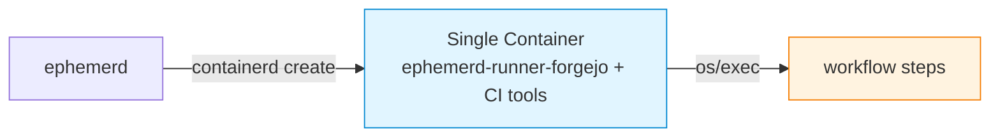
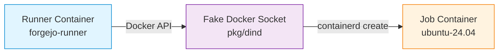

ephemerd uses OCI container images to define the execution environment for each job. The image determines what tools, runtimes, and system packages are available during the workflow run.

## GitHub Actions

### How it works

GitHub Actions jobs run inside a single container. The runner binary lives inside the image, and job steps execute in the same container. ephemerd pulls the image, starts a container, and the embedded runner picks up the job.

### Default images

| Platform | Default image |
|----------|--------------|
| Linux | `ghcr.io/actions/actions-runner:latest` |
| Windows | `mcr.microsoft.com/windows/servercore:ltsc20XX` (auto-detected) |

### Specifying an image

Use the `container:` key in your workflow YAML:

```yaml
jobs:
  build:
    runs-on: [self-hosted, linux, x64]
    container: ghcr.io/your-org/ci-image:latest
    steps:
      - uses: actions/checkout@v4
      - run: make test
```

### Building custom images

Custom images must extend the upstream GitHub Actions runner base image. This is important -- the base includes the runner binary that ephemerd needs to execute jobs.

**Linux:**

```dockerfile
FROM ghcr.io/actions/actions-runner:latest

USER root

RUN apt-get update && apt-get install -y \
    build-essential cmake autoconf automake \
    git curl wget pkg-config \
    && rm -rf /var/lib/apt/lists/*

# Add language runtimes, SDKs, etc.
# RUN curl --proto '=https' --tlsv1.2 -sSf https://sh.rustup.rs | sh -s -- -y

USER runner
```

For multi-arch builds (amd64 + arm64):

```bash
docker buildx build --platform linux/amd64,linux/arm64 \
    -t ghcr.io/your-org/ci-image:latest --push .
```

**Windows:**

```dockerfile
# escape=`
FROM ghcr.io/actions/actions-runner:latest-win

ARG GO_VERSION=1.26.6

SHELL ["powershell", "-Command", "$ErrorActionPreference = 'Stop';"]

# Install into the runner tool cache, not C:\go — see "Windows: preinstall into
# the tool cache" below.
RUN Invoke-WebRequest -Uri "https://go.dev/dl/go${env:GO_VERSION}.windows-amd64.zip" -OutFile go.zip; `
    Expand-Archive go.zip -DestinationPath C:\go-extract; `
    New-Item -ItemType Directory -Force -Path "C:\hostedtoolcache\go\${env:GO_VERSION}" | Out-Null; `
    Move-Item C:\go-extract\go "C:\hostedtoolcache\go\${env:GO_VERSION}\x64"; `
    New-Item -ItemType File -Path "C:\hostedtoolcache\go\${env:GO_VERSION}\x64.complete" | Out-Null; `
    Remove-Item -Recurse -Force go.zip, C:\go-extract
ENV PATH="C:\hostedtoolcache\go\${GO_VERSION}\x64\bin;C:\Windows\System32;C:\Windows;C:\Windows\System32\Wbem;C:\Windows\System32\WindowsPowerShell\v1.0"
```

Windows images must be built on a Windows host.

#### Windows: preinstall into the tool cache

Putting a toolchain on `PATH` is not enough on Windows. `actions/setup-go`,
`setup-node`, `setup-python` and friends never look at `PATH` — they look in the
runner's **tool cache**, and if it is empty they download and extract their own
copy. On a Hyper-V isolated Windows job that extraction is the single slowest
thing in the job: the Go toolchain is roughly 15,000 files, and `setup-go` times
itself out after 8 minutes long before it finishes.

ephemerd sets `RUNNER_TOOL_CACHE=C:\hostedtoolcache` for every Windows job so
that the cache lives **inside the image**. The runner's own default,
`<runner root>\_work\_tool`, cannot work here: on Windows the runner root is a
per-job copy of a host directory that ephemerd maps into the container, so it
shadows anything the image put there and every write crosses a VSMB share into
the utility VM.

The layout is fixed by `actions/toolkit`, and all three parts are required:

```
C:\hostedtoolcache\<tool>\<x.y.z>\x64\          the tool itself (for Go, GOROOT)
C:\hostedtoolcache\<tool>\<x.y.z>\x64.complete  a marker FILE, sibling of the dir
```

- The version directory must be a full `x.y.z` semver. `1.26` is ignored.
- The `x64.complete` marker is not optional — without it the action reports a
  cache miss and downloads anyway.
- `x64` is the architecture name Node reports (`os.arch()`), not `amd64`.

A cache hit only happens on an **exact** version match, so pick the version your
workflows actually request. `go-version-file: go.mod` and `go-version: stable`
both resolve to an exact release. If you set `RUNNER_TOOL_CACHE` yourself — in
the image or via the job environment — ephemerd leaves your value alone.

### macOS (artifact image)

macOS jobs run in per-job VMs, not containers. Set the job's `container.image` in your workflow to deliver pre-built tools via an OCI artifact image. GitHub-hosted macOS runners ignore the `container:` key, but on ephemerd it names the image whose layers are extracted onto the running VM:

```yaml
jobs:
  build:
    runs-on: [self-hosted, macos]
    container:
      image: ghcr.io/your-org/macos-xcode16:latest
    steps:
      - run: xcodebuild -version
```

The image is a `FROM scratch` container with binaries copied from a builder stage. ephemerd pulls it, extracts the layers, and mounts them into the macOS VM via virtio-fs:

```dockerfile
FROM golang:1.26-bookworm AS builder
RUN GOOS=darwin GOARCH=arm64 go build -o /deps/bin/mage github.com/magefile/mage

FROM scratch
COPY --from=builder /deps /deps
```

## Forgejo / Gitea

There are two ways to run Forgejo/Gitea jobs, each with different image requirements.

### Option 1: ephemerd-runner-forgejo (single container)

ephemerd-runner-forgejo runs inside a single container alongside the workflow steps. ephemerd mounts the ephemerd-runner-forgejo binary into the container — the image just needs CI tools.



The default image is `gitea/runner-images:ubuntu-24.04`. Customize it by adding your build dependencies:

```dockerfile
FROM gitea/runner-images:ubuntu-24.04

RUN apt-get update && apt-get install -y \
    build-essential cmake pkg-config \
    && rm -rf /var/lib/apt/lists/*
```

### Option 2: upstream runner + fake Docker socket (two containers)

The upstream `forgejo-runner` / `act_runner` creates a separate job container via the Docker API. Two images are involved:

| Image | Purpose | Config key |
|-------|---------|------------|
| **Runner image** | Contains the runner daemon binary | `[runner] default_image` |
| **Job image** | Where workflow steps execute | `[forgejo] job_image` or `[gitea] job_image` |



Customize the job image the same way. The runner image rarely needs customization — the upstream images work out of the box.

### Config (both options)

```toml
[forgejo]
instance_url = "https://codeberg.org"
token = "runner-registration-token"
owner = "your-org"
job_image = "ghcr.io/your-org/ci-job:latest"
```

## GitLab

### How it works

GitLab uses a **custom executor model**. The `gitlab-runner` binary drives the job lifecycle and calls ephemerd scripts for each phase: `prepare` (create container), `run` (execute steps), `cleanup` (destroy container). ephemerd doesn't discover jobs -- `gitlab-runner` polls GitLab and delegates to ephemerd.

### Images

The job image comes from the `image:` field in `.gitlab-ci.yml` -- it's part of the job payload, so no extra API call is needed. You don't configure a default image in ephemerd; GitLab handles image selection.

```yaml
# .gitlab-ci.yml
build:
  image: ghcr.io/your-org/ci-image:latest
  script:
    - make test
```

Any Docker image works. The `gitlab-runner` custom executor creates the container via ephemerd, which uses containerd to pull and run it.

## Woodpecker CI

### How it works

Woodpecker uses an **agent model**. The Woodpecker agent connects to the server via gRPC, receives pipeline definitions, and creates containers for each step. ephemerd manages the agent lifecycle -- it runs the agent binary inside a container, and the agent creates step containers via the Docker API (intercepted by ephemerd's fake Docker socket, same as Forgejo/Gitea).

### Images

Pipeline step images are defined in `.woodpecker.yml`:

```yaml
# .woodpecker.yml
steps:
  - name: build
    image: ghcr.io/your-org/ci-image:latest
    commands:
      - make test
```

The agent pulls step images via the fake Docker socket. Any OCI image works. There's no separate "runner image" to configure -- the Woodpecker agent image is managed by ephemerd internally.

## Per-Repo Image Overrides

Override the default image for specific repositories in the config:

```toml
[runner]
default_image = "ghcr.io/your-org/ci-image:latest"

[runner.repo_images]
"my-go-project" = "ghcr.io/your-org/go-ci:latest"
"my-rust-project" = "ghcr.io/your-org/rust-ci:latest"
```

## One Image, Every Host

The same Linux container image runs identically on Linux, Windows (via the Hyper-V Linux VM), and macOS (via Virtualization.framework). In all three cases, containerd is the runtime that pulls and executes the image. There is no need to maintain separate images per host platform.

## Reference: ephemerd CI Images

ephemerd's own CI uses custom runner images that pre-cache all build dependencies. These live in the [`images/`](https://github.com/ephpm/ephemerd/tree/feat/ci-runner-images/images) directory and serve as a real-world example:

| Image | Base | What it caches |
|-------|------|----------------|
| `runner-ci-linux` | `ghcr.io/actions/actions-runner:latest` | Go, Mage, runner archive, CNI plugins, containerd shim, runc, golangci-lint |
| `runner-ci-windows` | `ghcr.io/actions/actions-runner:latest-win` | Go (in the tool cache, so `actions/setup-go` hits it), Mage, runner archive (Windows + Linux), golangci-lint |
| `runner-ci-macos` | `scratch` | Runner archive (macOS), Mage, golangci-lint (cross-compiled for darwin) |

The Linux image supports multi-arch (amd64 + arm64) via `docker buildx`. Each image includes an entrypoint script that copies the cached dependencies into the workspace so `mage ci` runs without downloading anything. The Go module cache is also enabled -- after the first CI job runs, the module cache is warm and all subsequent jobs skip the `go mod download` entirely. The first job downloads and builds everything; every job after that just copies in the cached assets and runs `mage ci`.
