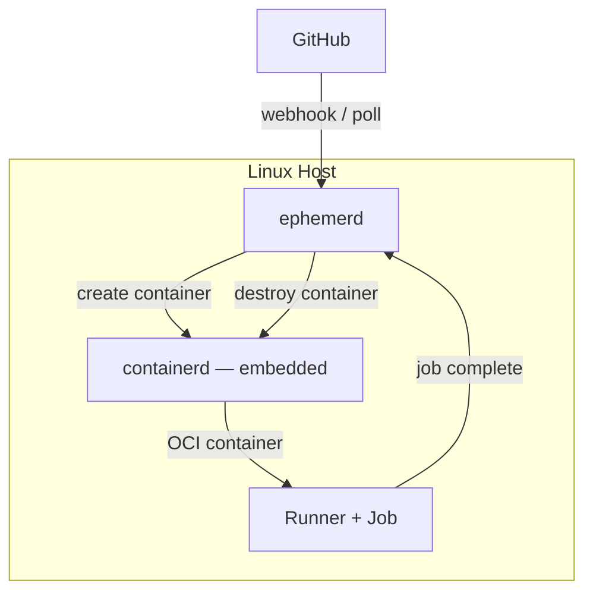
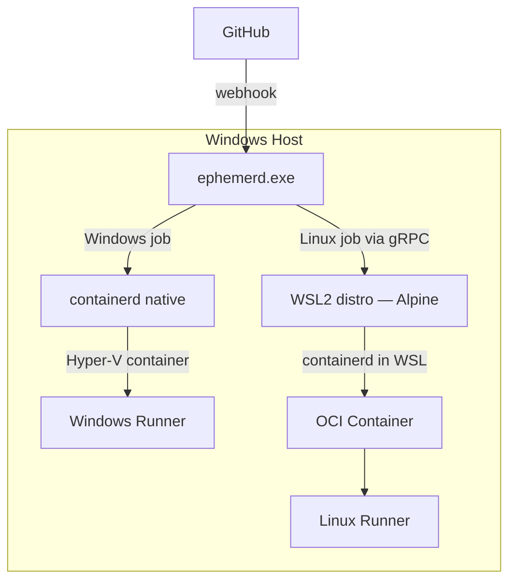
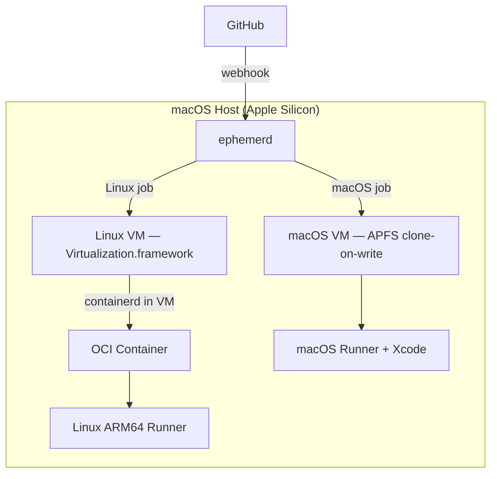

## Linux

Containers run directly on the host via the embedded containerd. No VM needed — fastest path.

## Windows

Windows jobs run in Hyper-V isolated containers (each gets its own kernel). Linux jobs are dispatched to a WSL2 distro via gRPC — ephemerd embeds an Alpine rootfs and a cross-compiled Linux binary, imports a WSL distro on startup, and runs containerd inside it. The Windows host runs a single scheduler that routes jobs by OS label.

## macOS

A long-running lightweight Linux VM (via Apple's Virtualization.framework) hosts containerd for Linux jobs — same OCI images, same Dockerfiles. macOS-native jobs (Xcode, Swift) get their own ephemeral macOS VM cloned from a base image via APFS copy-on-write (instant, no data copied until writes occur).

## Dual-Purpose Hosts

A single machine can serve multiple job types:

| Host | Linux jobs | Native OS jobs |
|------|-----------|----------------|
| Linux x86_64 | containerd direct | — |
| Linux arm64 | containerd direct | — |
| Windows x86_64 | Hyper-V Linux VM | Hyper-V Windows containers |
| macOS arm64 | Virtualization.framework Linux VM | macOS VM (clone-on-write) |

**A Windows box and a Mac Mini covers every combination:** linux/amd64, linux/arm64, windows/amd64.
