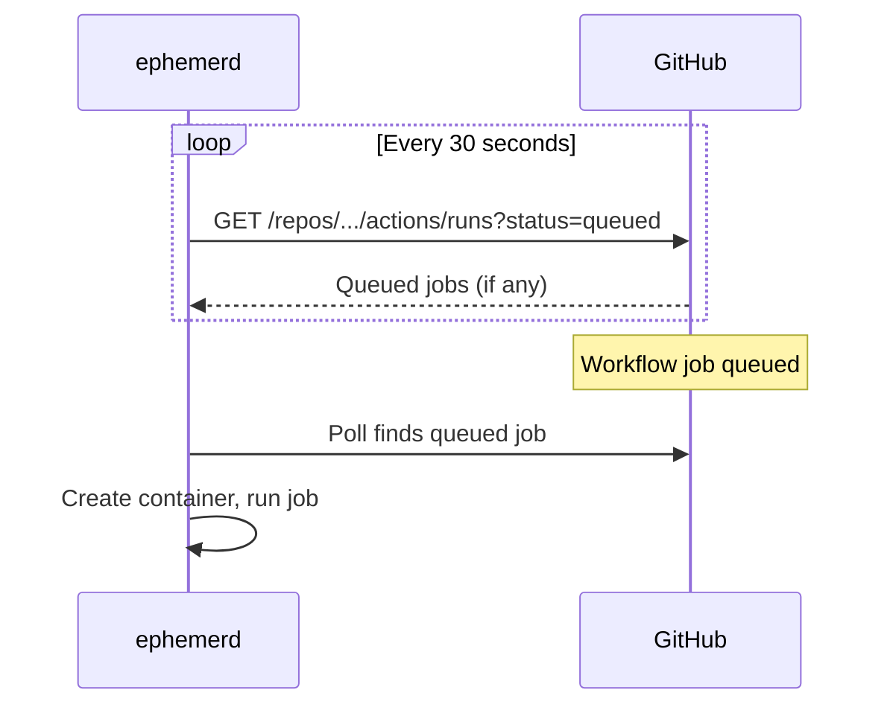
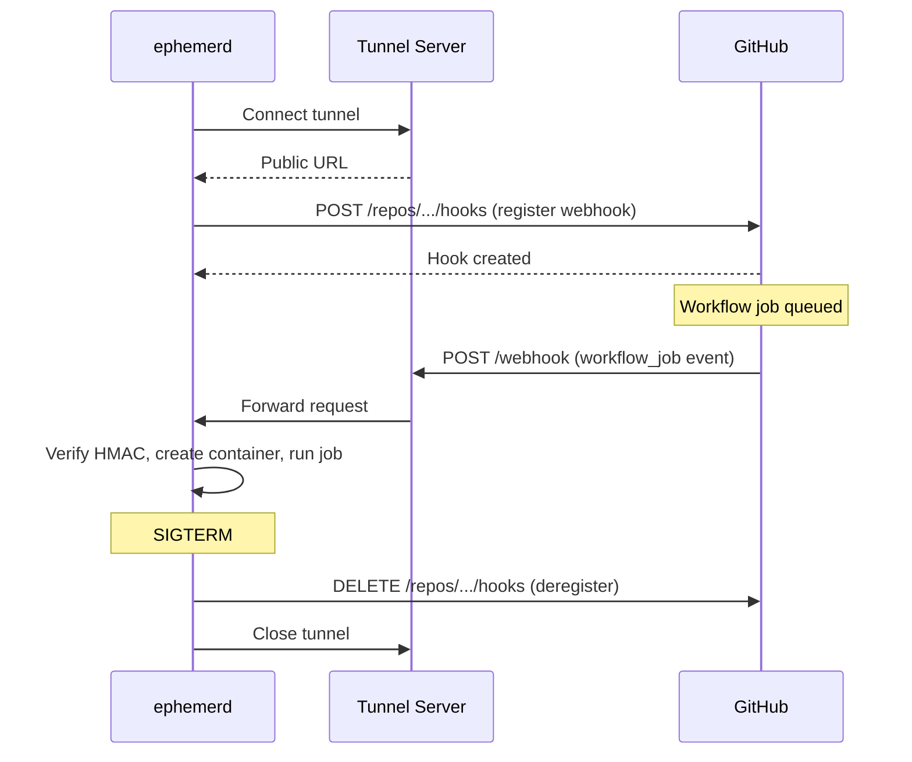

## Polling (default)

By default, ephemerd polls the GitHub API for queued jobs every 30 seconds. No inbound ports, no tunnels, no TLS certificates — works behind NAT, on laptops, anywhere.



Tune the interval in the config:

```toml
[github]
poll_interval = "10s"   # faster polling, uses more API quota
```

### Rate limits and GitHub App authentication

A personal access token (PAT) gets 5,000 API requests per hour. At the default 30s poll interval, ephemerd uses ~120 requests/hour per repo — fine for many repos, but it adds up.

For higher limits, use a [GitHub App](https://docs.github.com/en/apps/creating-github-apps/about-creating-github-apps/about-creating-github-apps) instead of a PAT. GitHub Apps get 15,000 requests per hour per installation and don't count against your personal quota.

1. [Create a GitHub App](https://github.com/settings/apps/new) with these permissions:
   - **Repository permissions**: Actions (read), Administration (read/write)
   - **Organization permissions**: Self-hosted runners (read/write)
   - **Subscribe to events**: Workflow job
2. Generate a private key and download the `.pem` file
3. Install the app on your org or repos
4. Configure ephemerd:

```toml
[github]
app_id = 123456
installation_id = 789012
private_key_path = "/path/to/app.pem"
owner = "your-org"
```

## Webhook via Tunnel (opt-in)

For instant job delivery with zero latency, ephemerd can create a tunnel and register webhooks automatically. On startup it generates a random HMAC secret, registers a `workflow_job` webhook on GitHub, and starts receiving events. On shutdown, the webhook is removed.



```toml
[webhook]
tunnel = "localtunnel"
tunnel_url = "http://tunnels.example.com"
```

Or use [ngrok](https://ngrok.com) (requires free account):

```toml
[webhook]
tunnel = "ngrok"
ngrok_authtoken = "your-token"
```

## Webhook via Direct TLS (VPS / public IP)

If your machine has a public IP and a TLS certificate, ephemerd can receive webhooks directly — no tunnel needed.

```toml
[webhook]
tunnel = "none"
tls_cert = "/etc/ephemerd/tls.crt"
tls_key = "/etc/ephemerd/tls.key"
secret = "your-webhook-secret"
port = 8080
```
